# Vitora HMIS — Architecture Diagrams

> **Last Updated**: July 2026
> **Purpose**: Visual reference for the full system architecture

---

## 1. High-Level System Architecture

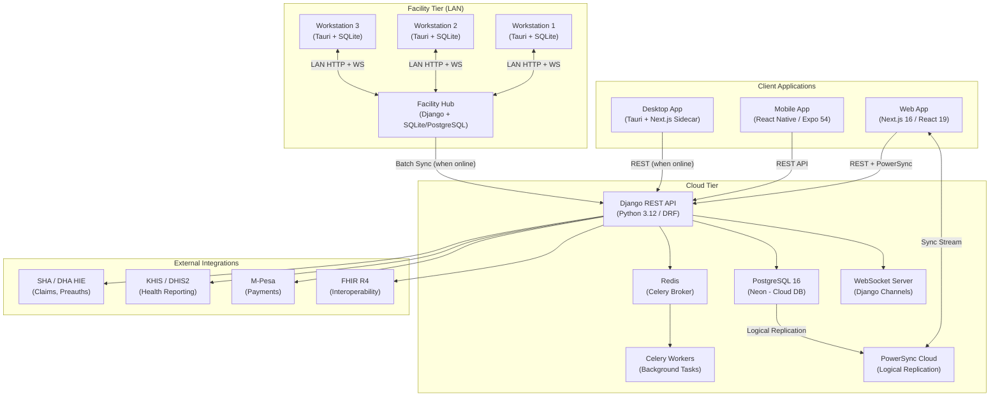

---

## 2. Deployment Modes

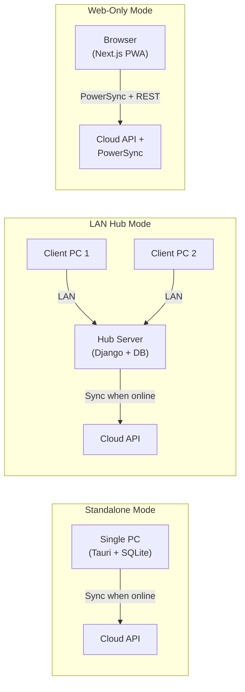

---

## 3. Backend Application Structure (38 Django Apps)

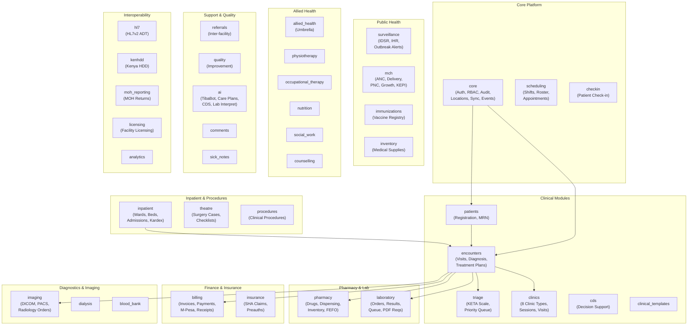

---

## 4. Data Flow — Patient Journey

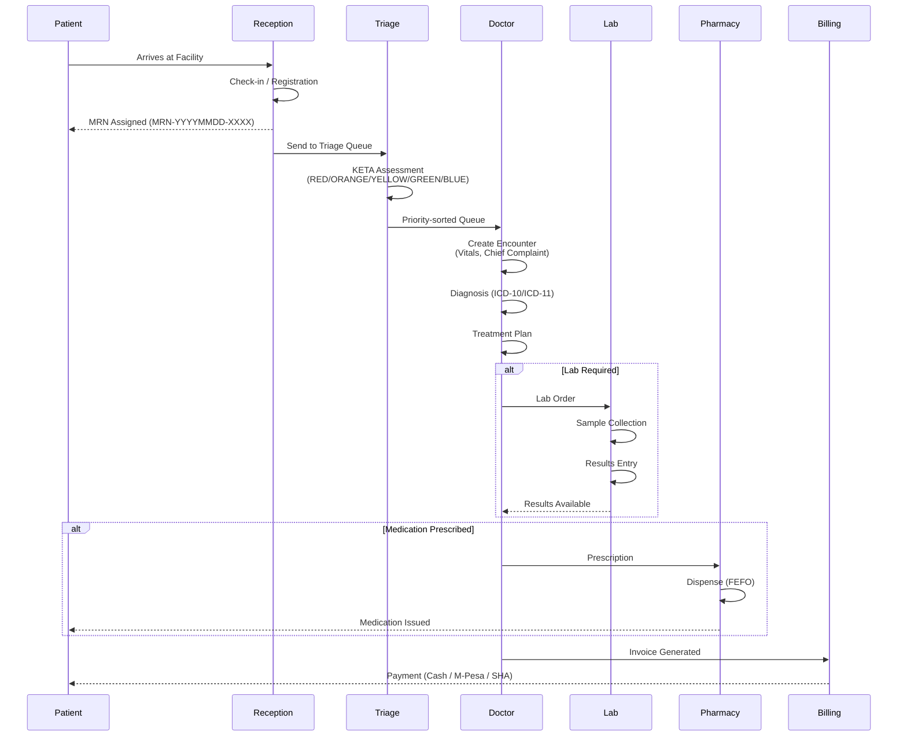

---

## 5. Multi-Tenancy Architecture

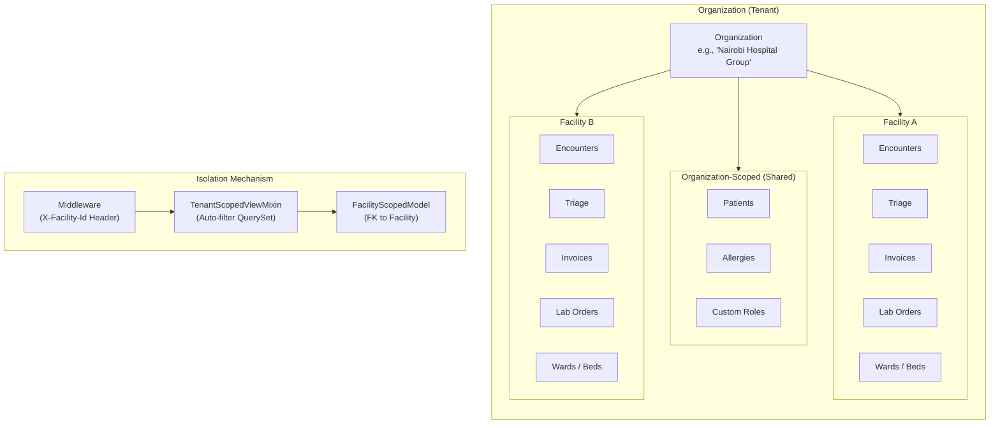

---

## 6. Authentication & Security

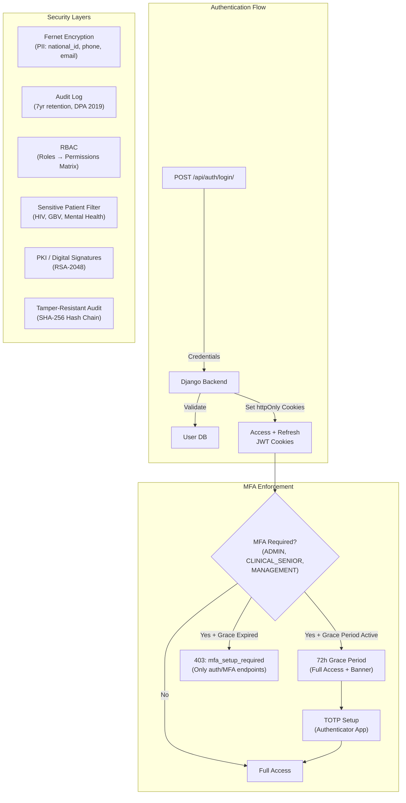

---

## 7. Offline-First Data Sync

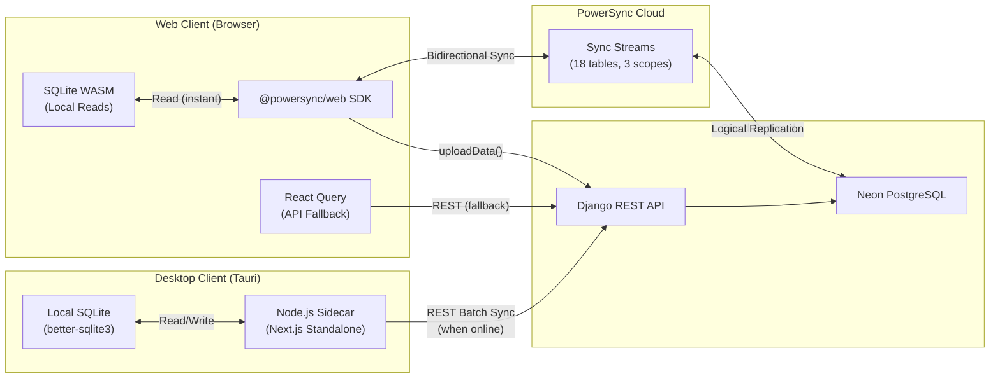

---

## 8. Domain Events & Real-Time Architecture

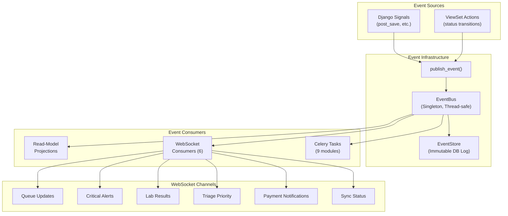

---

## 9. SHA / DHA HIE Integration

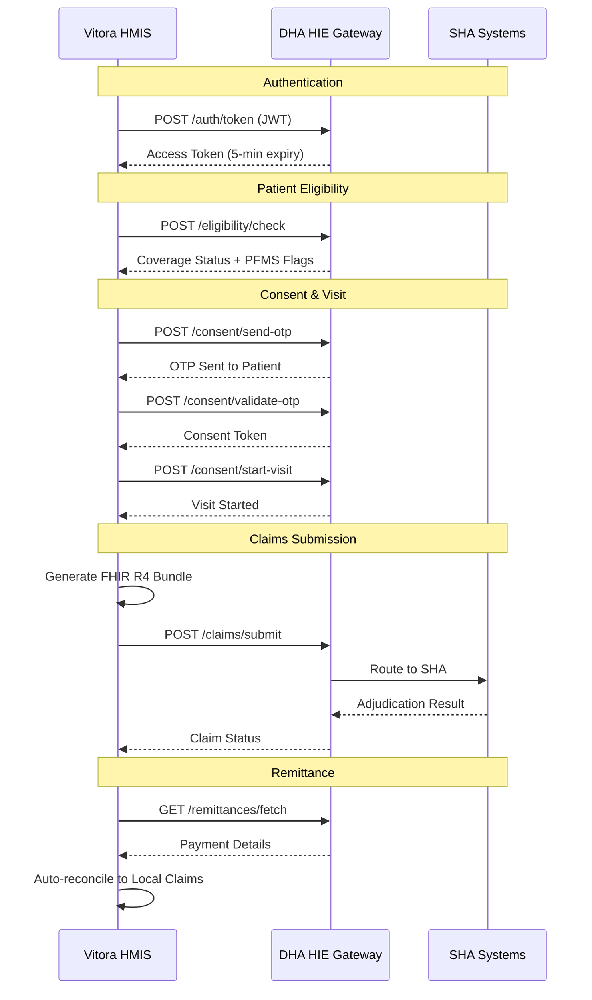

---

## 10. CI/CD Pipeline

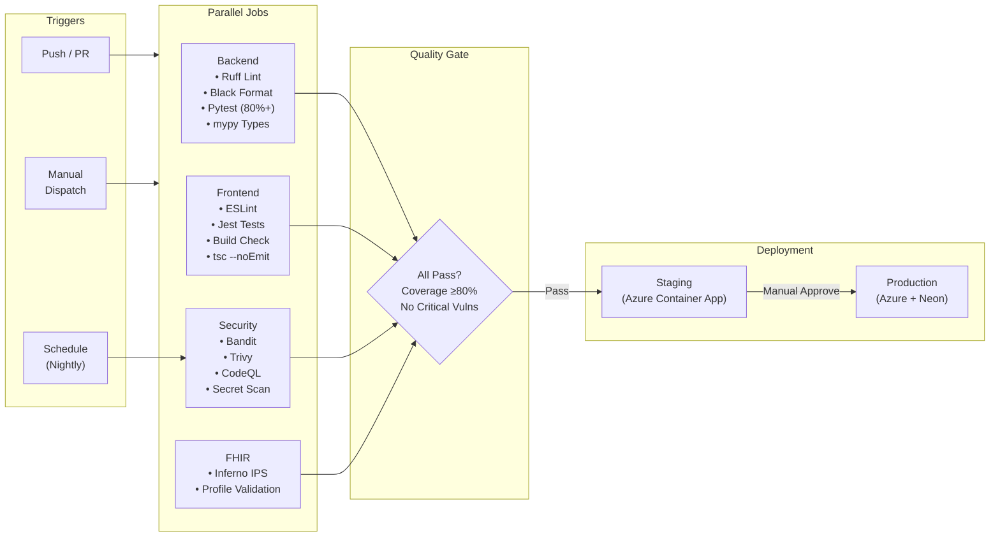

---

## 11. Frontend Architecture (Web App)

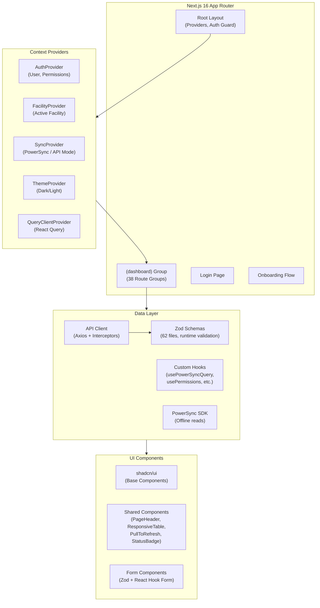

---

## 12. Database Schema — Core Relationships

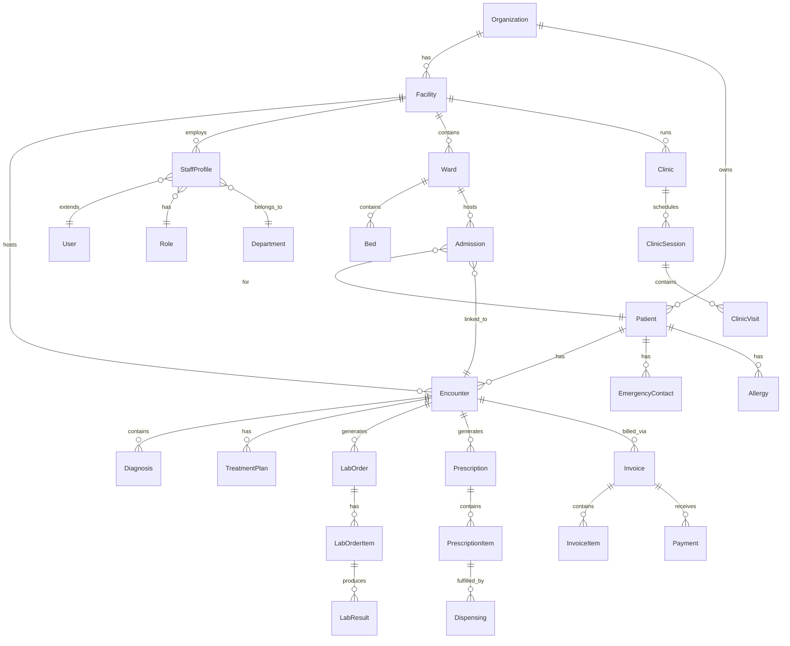

---

## 13. Technology Stack Summary

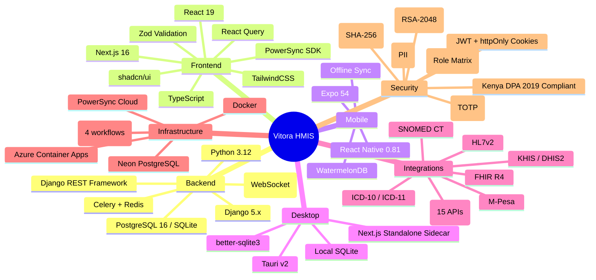

---

## 14. Network Topology — Production

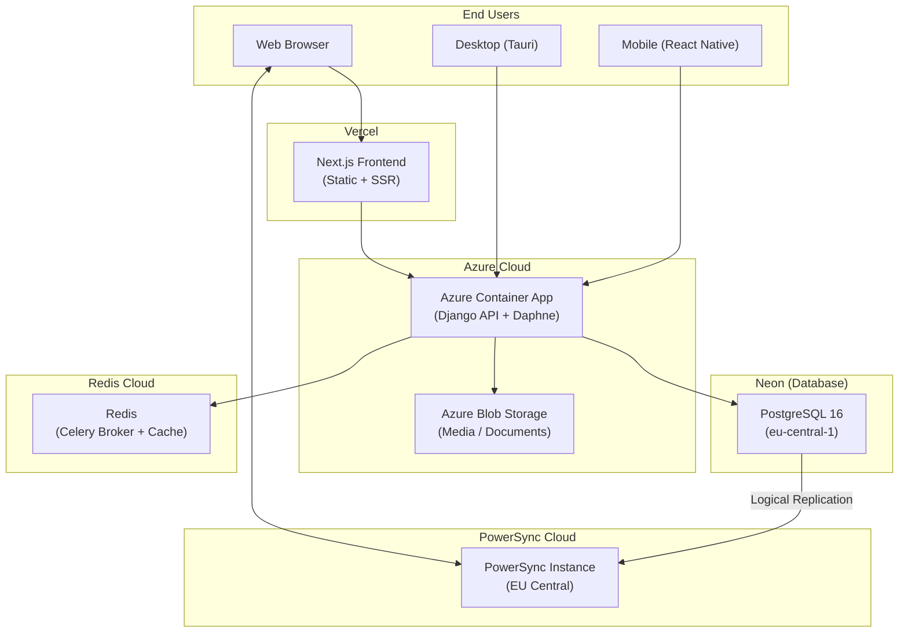

---

## Notes

- All diagrams use Mermaid syntax and render on GitHub and in VS Code (with bierner.markdown-mermaid extension).
- For the module list and descriptions, see `docs/modules-reference.md`.
- For API endpoint details, see `docs/api-reference.md`.
- For domain event catalog, see `docs/domain-events.md`.
- For multi-tenancy details, see `docs/multitenancy.md`.
