# Vitora HMIS — Architecture Diagrams

> **Last Updated**: October 2026
> **Purpose**: Visual reference for the full system architecture

---

## 1. High-Level System Architecture

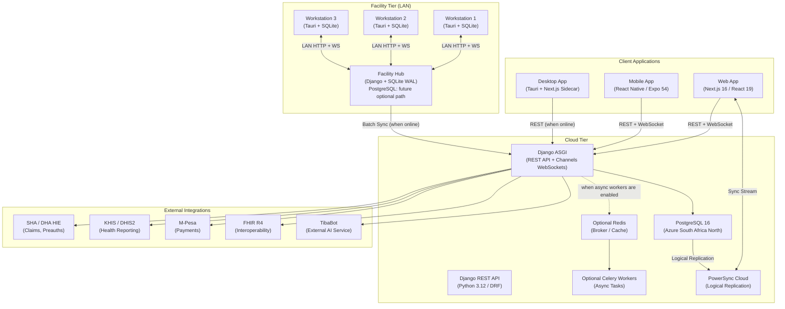
```mermaid
graph TB
    subgraph Clients["Client Applications"]
        WEB["Web App<br/>(Next.js 16 / React 19)"]
        DESK["Desktop App<br/>(Tauri + Next.js Sidecar)"]
        MOB["Mobile App<br/>(React Native / Expo 54)"]
    end

    subgraph Cloud["Cloud Tier"]
        API["Django REST API<br/>(Python 3.12 / DRF)"]
        PG["PostgreSQL 16<br/>(Azure South Africa North)"]
        REDIS["Optional Redis<br/>(Broker / Cache)"]
        CELERY["Optional Celery Workers<br/>(Async Tasks)"]
        PS["PowerSync Cloud<br/>(Logical Replication)"]
        ASGI["Django ASGI<br/>(REST API + Channels WebSockets)"]
    end

    subgraph Facility["Facility Tier (LAN)"]
        HUB["Facility Hub<br/>(Django + SQLite WAL)<br/>PostgreSQL: future optional path"]
        PC1["Workstation 1<br/>(Tauri + SQLite)"]
        PC2["Workstation 2<br/>(Tauri + SQLite)"]
        PC3["Workstation 3<br/>(Tauri + SQLite)"]
    end

    subgraph External["External Integrations"]
        SHA["SHA / DHA HIE<br/>(Claims, Preauths)"]
        KHIS["KHIS / DHIS2<br/>(Health Reporting)"]
        MPESA["M-Pesa<br/>(Payments)"]
        FHIR["FHIR R4<br/>(Interoperability)"]
        TIBABOT["TibaBot<br/>(External AI Service)"]
    end

    WEB -->|"REST + WebSocket"| ASGI
    WEB <-->|"Sync Stream"| PS
    MOB -->|"REST + WebSocket"| ASGI
    DESK -->|"REST (when online)"| ASGI

    ASGI --> PG
    ASGI -. "when async workers are enabled" .-> REDIS
    REDIS --> CELERY
    PG -->|"Logical Replication"| PS

    HUB -->|"Batch Sync (when online)"| ASGI
    PC1 <-->|"LAN HTTP + WS"| HUB
    PC2 <-->|"LAN HTTP + WS"| HUB
    PC3 <-->|"LAN HTTP + WS"| HUB

    ASGI --> SHA
    ASGI --> KHIS
    ASGI --> MPESA
    ASGI --> FHIR
    ASGI --> TIBABOT
```
---

## 2. Deployment Modes

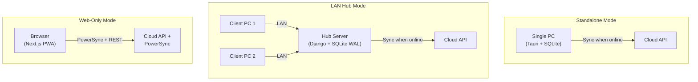
```mermaid
graph TB
    subgraph Mode1["Standalone Mode"]
        S1["Single PC<br/>(Tauri + SQLite)"]
        S1 -->|"Sync when online"| CLOUD1["Cloud API"]
    end

    subgraph Mode2["LAN Hub Mode"]
        H["Hub Server<br/>(Django + SQLite WAL)"]
        C1["Client PC 1"]
        C2["Client PC 2"]
        C1 -->|LAN| H
        C2 -->|LAN| H
        H -->|"Sync when online"| CLOUD2["Cloud API"]
    end

    subgraph Mode3["Web-Only Mode"]
        B["Browser<br/>(Next.js PWA)"]
        B -->|"PowerSync + REST"| CLOUD3["Cloud API +<br/>PowerSync"]
    end
```

---

## 3. Backend Application Structure (38 Django Apps)

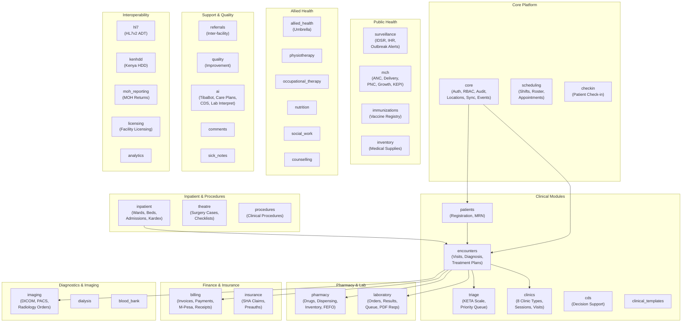
```mermaid
graph TB
    subgraph Core["Core Platform"]
        CORE["core<br/>(Auth, RBAC, Audit,<br/>Locations, Sync, Events)"]
        SCHED["scheduling<br/>(Shifts, Roster,<br/>Appointments)"]
        CHECKIN["checkin<br/>(Patient Check-in)"]
    end

    subgraph Clinical["Clinical Modules"]
        PAT["patients<br/>(Registration, MRN)"]
        ENC["encounters<br/>(Visits, Diagnosis,<br/>Treatment Plans)"]
        TRIAGE["triage<br/>(KETA Scale,<br/>Priority Queue)"]
        CLINIC["clinics<br/>(8 Clinic Types,<br/>Sessions, Visits)"]
        CDS_APP["cds<br/>(Decision Support)"]
        TEMPLATES["clinical_templates"]
    end

    subgraph Pharmacy_Lab["Pharmacy & Lab"]
        PHARM["pharmacy<br/>(Drugs, Dispensing,<br/>Inventory, FEFO)"]
        LAB["laboratory<br/>(Orders, Results,<br/>Queue, PDF Reqs)"]
    end

    subgraph Inpatient_Module["Inpatient & Procedures"]
        INP["inpatient<br/>(Wards, Beds,<br/>Admissions, Kardex)"]
        THEATRE_APP["theatre<br/>(Surgery Cases,<br/>Checklists)"]
        PROC["procedures<br/>(Clinical Procedures)"]
    end

    subgraph Finance["Finance & Insurance"]
        BILL["billing<br/>(Invoices, Payments,<br/>M-Pesa, Receipts)"]
        INS["insurance<br/>(SHA Claims,<br/>Preauths)"]
    end

    subgraph Diagnostics["Diagnostics & Imaging"]
        IMG["imaging<br/>(DICOM, PACS,<br/>Radiology Orders)"]
        DIALYSIS["dialysis"]
        BLOOD["blood_bank"]
    end

    subgraph PublicHealth["Public Health"]
        SURV["surveillance<br/>(IDSR, IHR,<br/>Outbreak Alerts)"]
        MCH["mch<br/>(ANC, Delivery,<br/>PNC, Growth, KEPI)"]
        IMMUN["immunizations<br/>(Vaccine Registry)"]
        INV["inventory<br/>(Medical Supplies)"]
    end

    subgraph Allied["Allied Health"]
        AH["allied_health<br/>(Umbrella)"]
        PHYSIO["physiotherapy"]
        OT["occupational_therapy"]
        NUTR["nutrition"]
        SW["social_work"]
        COUNS["counselling"]
    end

    subgraph Support["Support & Quality"]
        REF["referrals<br/>(Inter-facility)"]
        QUAL["quality<br/>(Improvement)"]
        AI_APP["ai<br/>(TibaBot, Care Plans,<br/>CDS, Lab Interpret)"]
        COMMENTS["comments"]
        SICK["sick_notes"]
    end

    subgraph Interop["Interoperability"]
        HL7["hl7<br/>(HL7v2 ADT)"]
        KENHDD["kenhdd<br/>(Kenya HDD)"]
        MOH["moh_reporting<br/>(MOH Returns)"]
        LIC["licensing<br/>(Facility Licensing)"]
        ANALYTICS["analytics"]
    end

    CORE --> PAT
    CORE --> ENC
    PAT --> ENC
    ENC --> TRIAGE
    ENC --> CLINIC
    ENC --> LAB
    ENC --> PHARM
    ENC --> BILL
    ENC --> IMG
    INP --> ENC
```

---

## 4. Data Flow — Patient Journey

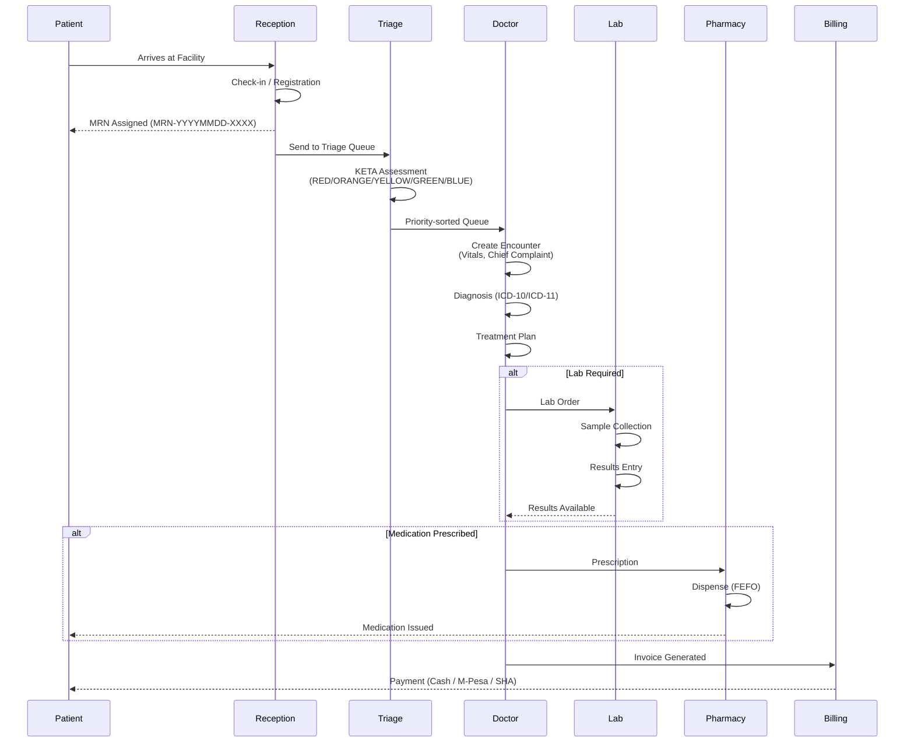
```mermaid
sequenceDiagram
    participant P as Patient
    participant R as Reception
    participant T as Triage
    participant D as Doctor
    participant L as Lab
    participant PH as Pharmacy
    participant B as Billing

    P->>R: Arrives at Facility
    R->>R: Check-in / Registration
    R-->>P: MRN Assigned (MRN-YYYYMMDD-XXXX)

    R->>T: Send to Triage Queue
    T->>T: KETA Assessment<br/>(RED/ORANGE/YELLOW/GREEN/BLUE)
    T->>D: Priority-sorted Queue

    D->>D: Create Encounter<br/>(Vitals, Chief Complaint)
    D->>D: Diagnosis (ICD-10/ICD-11)
    D->>D: Treatment Plan

    alt Lab Required
        D->>L: Lab Order
        L->>L: Sample Collection
        L->>L: Results Entry
        L-->>D: Results Available
    end

    alt Medication Prescribed
        D->>PH: Prescription
        PH->>PH: Dispense (FEFO)
        PH-->>P: Medication Issued
    end

    D->>B: Invoice Generated
    B-->>P: Payment (Cash / M-Pesa / SHA)
```

---

## 5. Multi-Tenancy Architecture

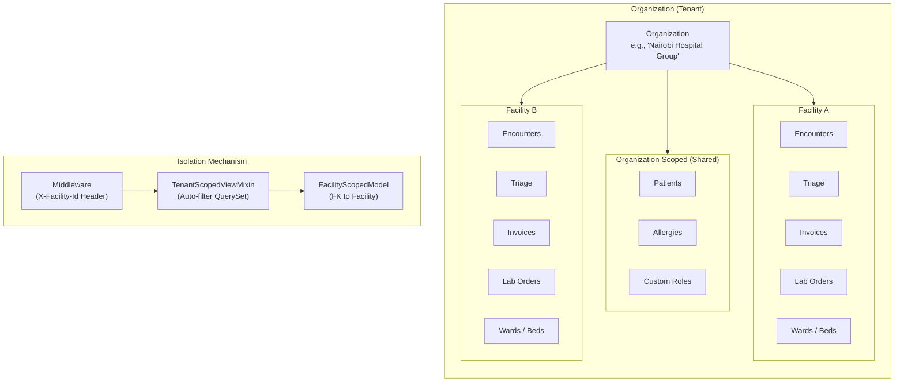
```mermaid
graph TB
    subgraph Org["Organization (Tenant)"]
        direction TB
        ORG["Organization<br/>e.g., 'Nairobi Hospital Group'"]

        subgraph Shared["Organization-Scoped (Shared)"]
            PATIENTS["Patients"]
            ALLERGIES["Allergies"]
            ROLES["Custom Roles"]
        end

        subgraph FacA["Facility A"]
            ENC_A["Encounters"]
            TRIAGE_A["Triage"]
            INV_A["Invoices"]
            LAB_A["Lab Orders"]
            WARD_A["Wards / Beds"]
        end

        subgraph FacB["Facility B"]
            ENC_B["Encounters"]
            TRIAGE_B["Triage"]
            INV_B["Invoices"]
            LAB_B["Lab Orders"]
            WARD_B["Wards / Beds"]
        end
    end

    subgraph Isolation["Isolation Mechanism"]
        MW["Middleware<br/>(X-Facility-Id Header)"]
        VM["TenantScopedViewMixin<br/>(Auto-filter QuerySet)"]
        FM["FacilityScopedModel<br/>(FK to Facility)"]
    end

    ORG --> Shared
    ORG --> FacA
    ORG --> FacB
    MW --> VM
    VM --> FM
```

---

## 6. Authentication

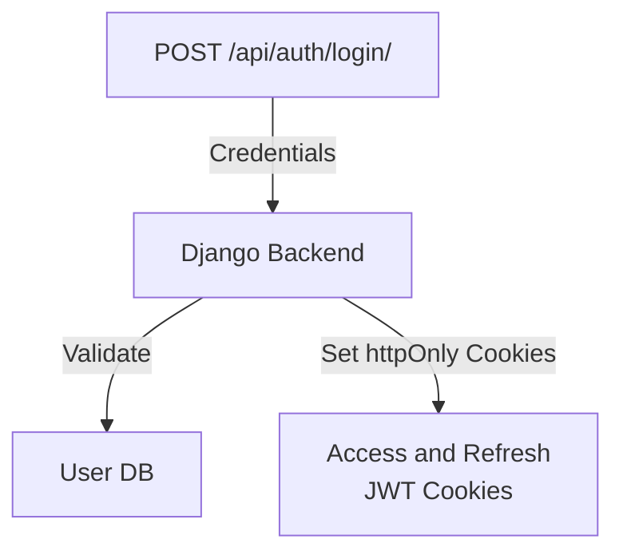
```mermaid
graph TB
    LOGIN["POST /api/auth/login/"]
    LOGIN -->|"Credentials"| BACKEND["Django Backend"]
    BACKEND -->|"Validate"| DB["User DB"]
    BACKEND -->|"Set httpOnly Cookies"| COOKIES["Access and Refresh<br/>JWT Cookies"]
```

---

## 6b. MFA Enforcement

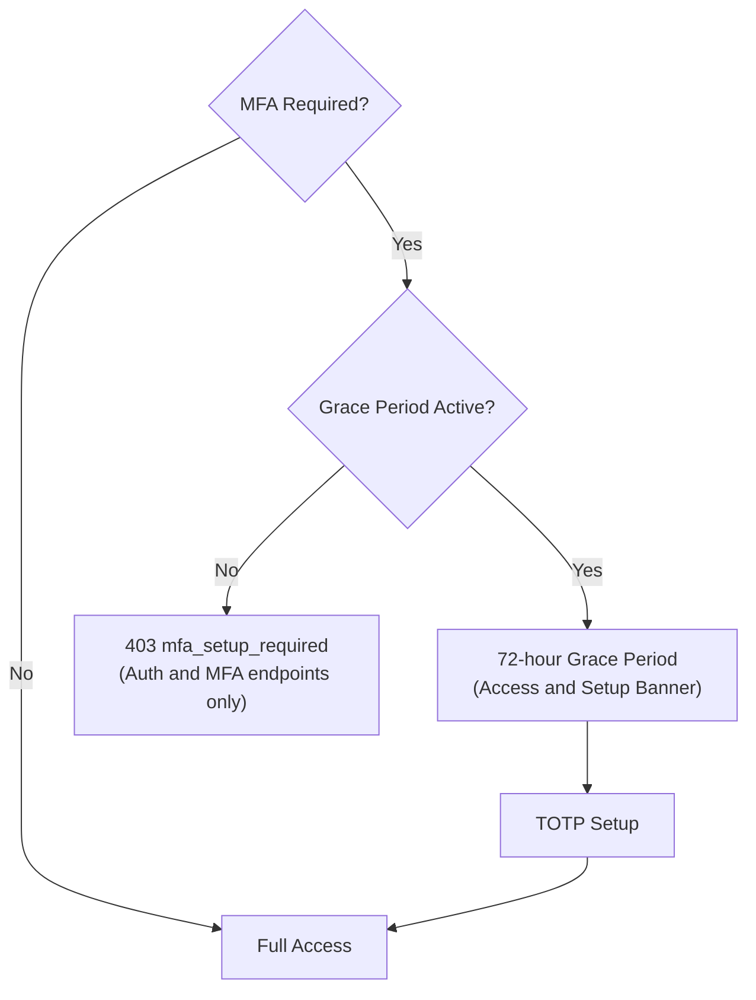
```mermaid
graph TB
    CHECK{"MFA Required?"}
    CHECK -->|"No"| PASS["Full Access"]
    CHECK -->|"Yes"| GRACE_CHECK{"Grace Period Active?"}
    GRACE_CHECK -->|"Yes"| GRACE["72-hour Grace Period<br/>(Access and Setup Banner)"]
    GRACE --> TOTP["TOTP Setup"]
    TOTP --> PASS
    GRACE_CHECK -->|"No"| BLOCK["403 mfa_setup_required<br/>(Auth and MFA endpoints only)"]
```

---

## 6c. Security Controls

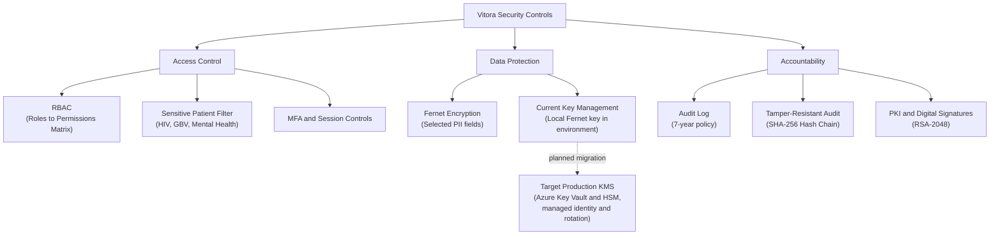
```mermaid
graph TB
    SECURITY["Vitora Security Controls"]

    SECURITY --> ACCESS["Access Control"]
    ACCESS --> RBAC["RBAC<br/>(Roles to Permissions Matrix)"]
    ACCESS --> SENSITIVE["Sensitive Patient Filter<br/>(HIV, GBV, Mental Health)"]
    ACCESS --> MFA["MFA and Session Controls"]

    SECURITY --> DATA["Data Protection"]
    DATA --> FERNET["Fernet Encryption<br/>(Selected PII fields)"]
    DATA --> KMS_CURRENT["Current Key Management<br/>(Local Fernet key in environment)"]
    KMS_CURRENT -. "planned migration" .-> KMS_TARGET["Target Production KMS<br/>(Azure Key Vault and HSM,<br/>managed identity and rotation)"]

    SECURITY --> ACCOUNTABILITY["Accountability"]
    ACCOUNTABILITY --> AUDIT["Audit Log<br/>(7-year policy)"]
    ACCOUNTABILITY --> HASHCHAIN["Tamper-Resistant Audit<br/>(SHA-256 Hash Chain)"]
    ACCOUNTABILITY --> PKI["PKI and Digital Signatures<br/>(RSA-2048)"]
```

---

## 7. Offline-First Data Sync

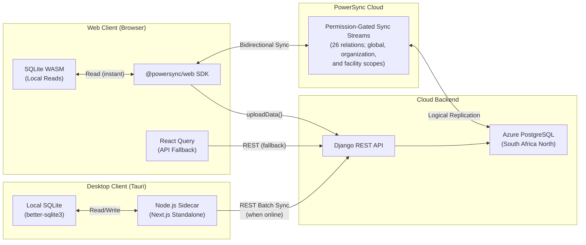
```mermaid
graph LR
    subgraph Browser["Web Client (Browser)"]
        WASM["SQLite WASM<br/>(Local Reads)"]
        SDK["@powersync/web SDK"]
        RQ["React Query<br/>(API Fallback)"]
    end

    subgraph PowerSync["PowerSync Cloud"]
        STREAM["Permission-Gated Sync Streams<br/>(26 relations; global, organization,<br/>and facility scopes)"]
    end

    subgraph Backend["Cloud Backend"]
        DJANGO["Django REST API"]
        PG_SYNC["Azure PostgreSQL<br/>(South Africa North)"]
    end

    subgraph Desktop["Desktop Client (Tauri)"]
        LOCAL_DB["Local SQLite<br/>(better-sqlite3)"]
        SIDECAR["Node.js Sidecar<br/>(Next.js Standalone)"]
    end

    WASM <-->|"Read (instant)"| SDK
    SDK <-->|"Bidirectional Sync"| STREAM
    STREAM <-->|"Logical Replication"| PG_SYNC
    SDK -->|"uploadData()"| DJANGO
    RQ -->|"REST (fallback)"| DJANGO
    DJANGO --> PG_SYNC

    LOCAL_DB <-->|"Read/Write"| SIDECAR
    SIDECAR -->|"REST Batch Sync<br/>(when online)"| DJANGO
```

---

## 8. Domain Events & Real-Time Architecture

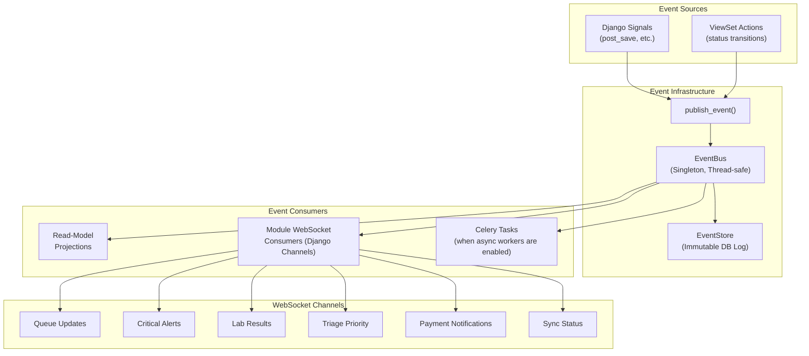
```mermaid
graph TB
    subgraph Trigger["Event Sources"]
        SIGNAL["Django Signals<br/>(post_save, etc.)"]
        VIEW["ViewSet Actions<br/>(status transitions)"]
    end

    subgraph EventBus["Event Infrastructure"]
        PUB["publish_event()"]
        BUS["EventBus<br/>(Singleton, Thread-safe)"]
        STORE["EventStore<br/>(Immutable DB Log)"]
    end

    subgraph Consumers["Event Consumers"]
        PROJ["Read-Model<br/>Projections"]
        WSOCK["Module WebSocket<br/>Consumers (Django Channels)"]
        TASK["Celery Tasks<br/>(when async workers are enabled)"]
    end

    subgraph WSChannels["WebSocket Channels"]
        QUEUE["Queue Updates"]
        ALERTS["Critical Alerts"]
        LAB_WS["Lab Results"]
        TRIAGE_WS["Triage Priority"]
        BILLING_WS["Payment Notifications"]
        SYNC_WS["Sync Status"]
    end

    SIGNAL --> PUB
    VIEW --> PUB
    PUB --> BUS
    BUS --> STORE
    BUS --> PROJ
    BUS --> WSOCK
    BUS --> TASK
    WSOCK --> QUEUE
    WSOCK --> ALERTS
    WSOCK --> LAB_WS
    WSOCK --> TRIAGE_WS
    WSOCK --> BILLING_WS
    WSOCK --> SYNC_WS
```

---

## 9. SHA / DHA HIE Integration

### 9a. Eligibility and Consent

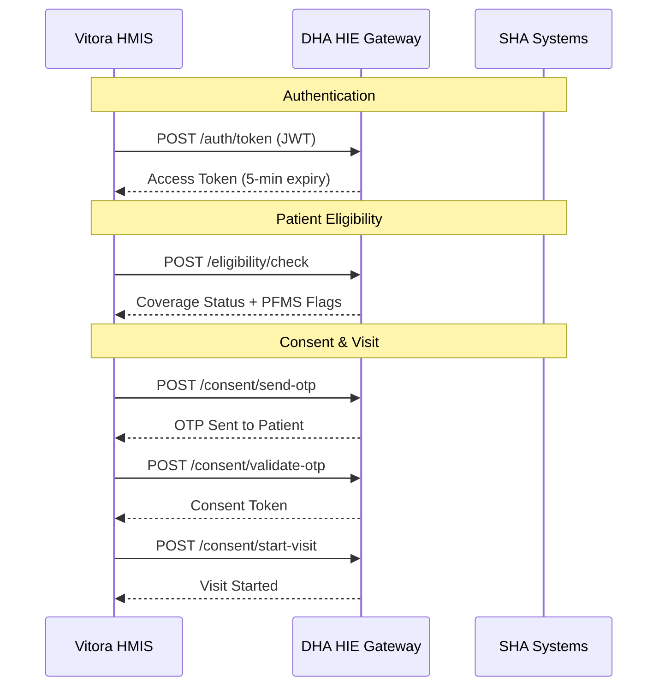
```mermaid
sequenceDiagram
    participant V as Vitora HMIS
    participant DHA as DHA HIE Gateway
    participant SHA_SYS as SHA Systems

    Note over V,SHA_SYS: Authentication
    V->>DHA: POST /auth/token (JWT)
    DHA-->>V: Access Token (5-min expiry)

    Note over V,SHA_SYS: Patient Eligibility
    V->>DHA: POST /eligibility/check
    DHA-->>V: Coverage Status + PFMS Flags

    Note over V,SHA_SYS: Consent & Visit
    V->>DHA: POST /consent/send-otp
    DHA-->>V: OTP Sent to Patient
    V->>DHA: POST /consent/validate-otp
    DHA-->>V: Consent Token
    V->>DHA: POST /consent/start-visit
    DHA-->>V: Visit Started

```

### 9b. Claim Submission and Adjudication

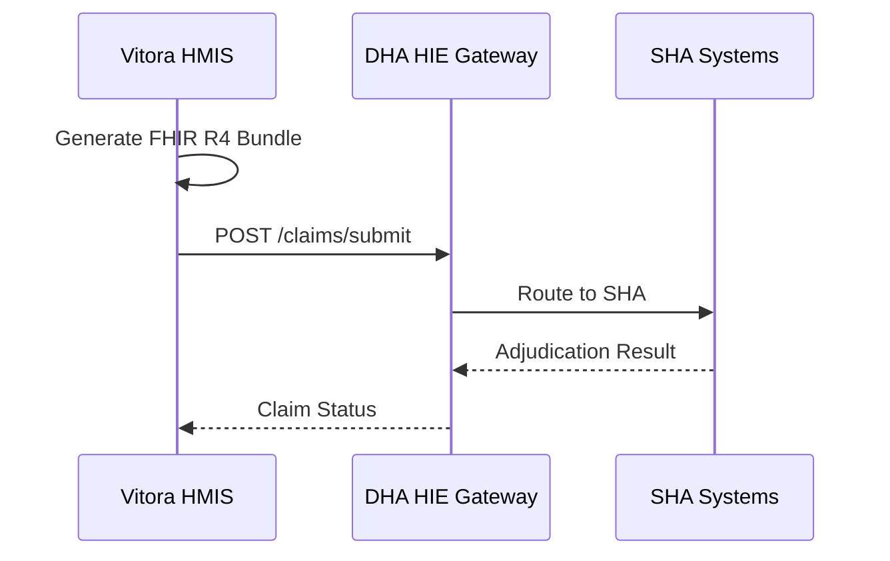
```mermaid
sequenceDiagram
    participant V as Vitora HMIS
    participant DHA as DHA HIE Gateway
    participant SHA_SYS as SHA Systems

    V->>V: Generate FHIR R4 Bundle
    V->>DHA: POST /claims/submit
    DHA->>SHA_SYS: Route to SHA
    SHA_SYS-->>DHA: Adjudication Result
    DHA-->>V: Claim Status
```

### 9c. ILM and Remittance

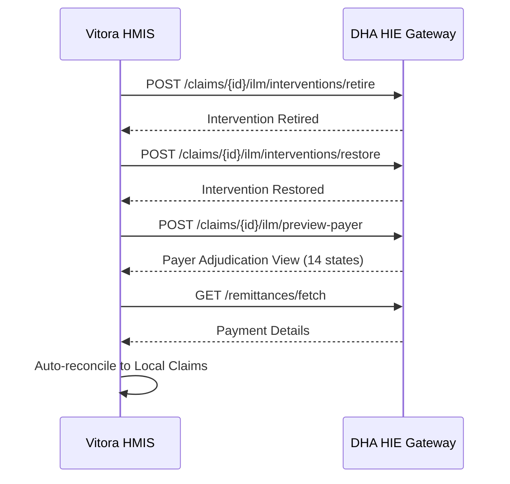
```mermaid
sequenceDiagram
    participant V as Vitora HMIS
    participant DHA as DHA HIE Gateway

    V->>DHA: POST /claims/{id}/ilm/interventions/retire
    DHA-->>V: Intervention Retired
    V->>DHA: POST /claims/{id}/ilm/interventions/restore
    DHA-->>V: Intervention Restored
    V->>DHA: POST /claims/{id}/ilm/preview-payer
    DHA-->>V: Payer Adjudication View (14 states)

    V->>DHA: GET /remittances/fetch
    DHA-->>V: Payment Details
    V->>V: Auto-reconcile to Local Claims
```

### 9d. Preauthorization Workflow

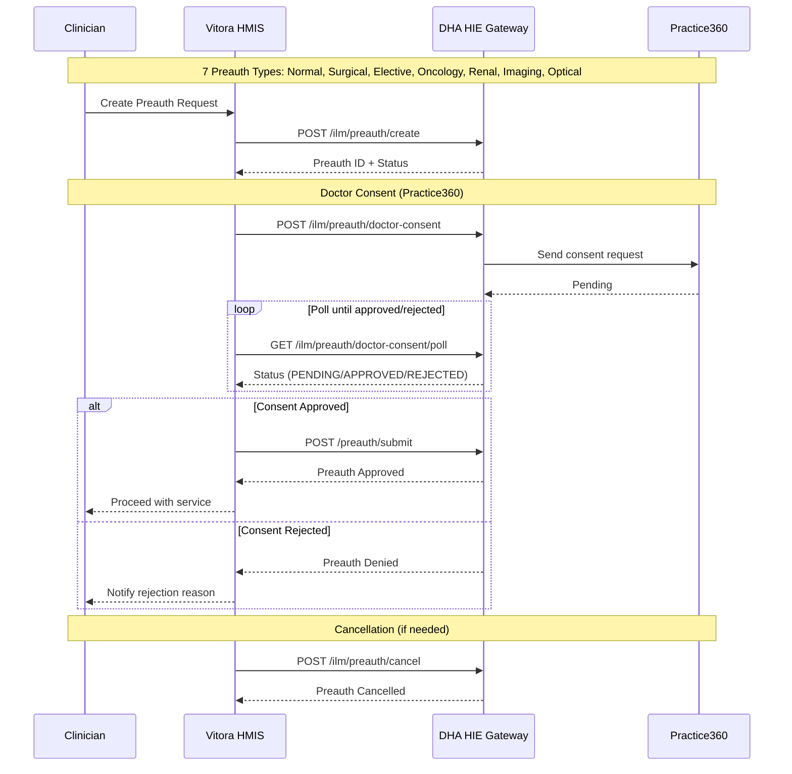
```mermaid
sequenceDiagram
    participant C as Clinician
    participant V as Vitora HMIS
    participant DHA as DHA HIE Gateway
    participant P360 as Practice360

    Note over C,P360: 7 Preauth Types: Normal, Surgical, Elective, Oncology, Renal, Imaging, Optical

    C->>V: Create Preauth Request
    V->>DHA: POST /ilm/preauth/create
    DHA-->>V: Preauth ID + Status

    Note over C,P360: Doctor Consent (Practice360)
    V->>DHA: POST /ilm/preauth/doctor-consent
    DHA->>P360: Send consent request
    P360-->>DHA: Pending

    loop Poll until approved/rejected
        V->>DHA: GET /ilm/preauth/doctor-consent/poll
        DHA-->>V: Status (PENDING/APPROVED/REJECTED)
    end

    alt Consent Approved
        V->>DHA: POST /preauth/submit
        DHA-->>V: Preauth Approved
        V-->>C: Proceed with service
    else Consent Rejected
        DHA-->>V: Preauth Denied
        V-->>C: Notify rejection reason
    end

    Note over C,P360: Cancellation (if needed)
    V->>DHA: POST /ilm/preauth/cancel
    DHA-->>V: Preauth Cancelled
```

---

## 10. CI/CD Pipeline

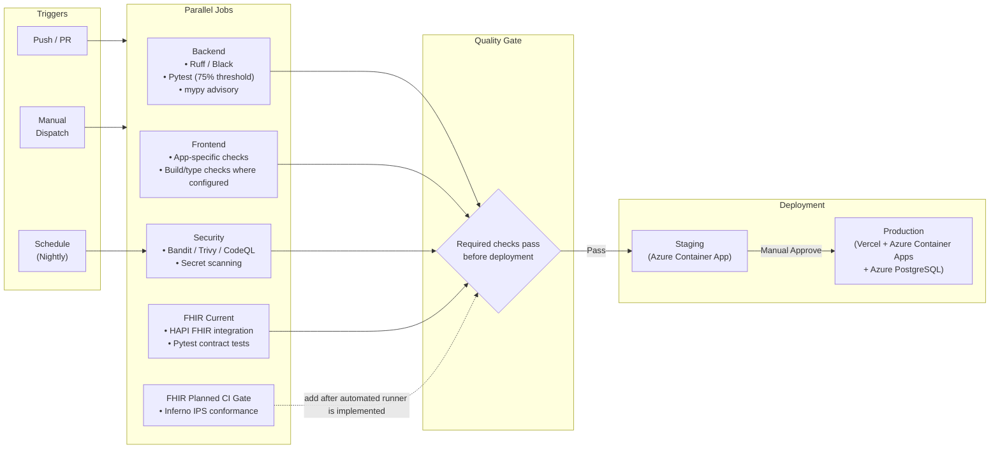
```mermaid
graph LR
    subgraph Trigger["Triggers"]
        PUSH["Push / PR"]
        SCHED["Schedule<br/>(Nightly)"]
        MANUAL["Manual<br/>Dispatch"]
    end

    subgraph Parallel["Parallel Jobs"]
        BE["Backend<br/>• Ruff / Black<br/>• Pytest (75% threshold)<br/>• mypy advisory"]
        FE["Frontend<br/>• App-specific checks<br/>• Build/type checks where configured"]
        SEC["Security<br/>• Bandit / Trivy / CodeQL<br/>• Secret scanning"]
        FHIR_CI["FHIR Current<br/>• HAPI FHIR integration<br/>• Pytest contract tests"]
        INFERNO["FHIR Planned CI Gate<br/>• Inferno IPS conformance"]
    end

    subgraph Gate["Quality Gate"]
        QG{"Required checks pass<br/>before deployment"}
    end

    subgraph Deploy["Deployment"]
        STG["Staging<br/>(Azure Container App)"]
        PROD["Production<br/>(Vercel + Azure Container Apps<br/>+ Azure PostgreSQL)"]
    end

    PUSH --> Parallel
    SCHED --> SEC
    MANUAL --> Parallel

    BE --> QG
    FE --> QG
    SEC --> QG
    FHIR_CI --> QG
    INFERNO -. "add after automated runner is implemented" .-> QG

    QG -->|"Pass"| STG
    STG -->|"Manual Approve"| PROD
```

---

## 11. Frontend Application Shell and Providers

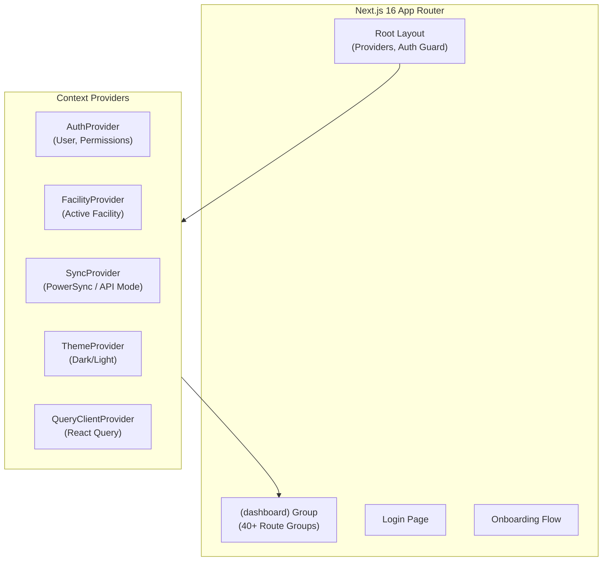
```mermaid
graph TB
    subgraph NextJS["Next.js 16 App Router"]
        LAYOUT["Root Layout<br/>(Providers, Auth Guard)"]
        DASH["(dashboard) Group<br/>(40+ Route Groups)"]
        LOGIN_PAGE["Login Page"]
        ONBOARD["Onboarding Flow"]
    end

    subgraph Providers["Context Providers"]
        AUTH_CTX["AuthProvider<br/>(User, Permissions)"]
        FAC_CTX["FacilityProvider<br/>(Active Facility)"]
        SYNC_CTX["SyncProvider<br/>(PowerSync / API Mode)"]
        THEME["ThemeProvider<br/>(Dark/Light)"]
        QUERY["QueryClientProvider<br/>(React Query)"]
    end

    LAYOUT --> Providers
    Providers --> DASH
```

---

## 11b. Frontend Data and UI Layers

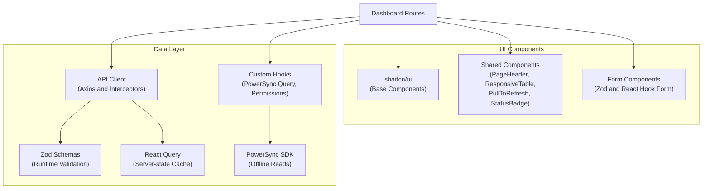
```mermaid
graph TB
    DASH["Dashboard Routes"]

    subgraph DataLayer["Data Layer"]
        API_CLIENT["API Client<br/>(Axios and Interceptors)"]
        ZOD["Zod Schemas<br/>(Runtime Validation)"]
        HOOKS["Custom Hooks<br/>(PowerSync Query, Permissions)"]
        POWERSYNC_SDK["PowerSync SDK<br/>(Offline Reads)"]
        QUERY["React Query<br/>(Server-state Cache)"]
    end

    subgraph UI["UI Components"]
        SHADCN["shadcn/ui<br/>(Base Components)"]
        SHARED["Shared Components<br/>(PageHeader, ResponsiveTable,<br/>PullToRefresh, StatusBadge)"]
        FORMS["Form Components<br/>(Zod and React Hook Form)"]
    end

    DASH --> API_CLIENT
    DASH --> HOOKS
    HOOKS --> POWERSYNC_SDK
    API_CLIENT --> ZOD
    API_CLIENT --> QUERY
    DASH --> SHADCN
    DASH --> SHARED
    DASH --> FORMS
```

---

## 12. Database Schema — Core Relationships

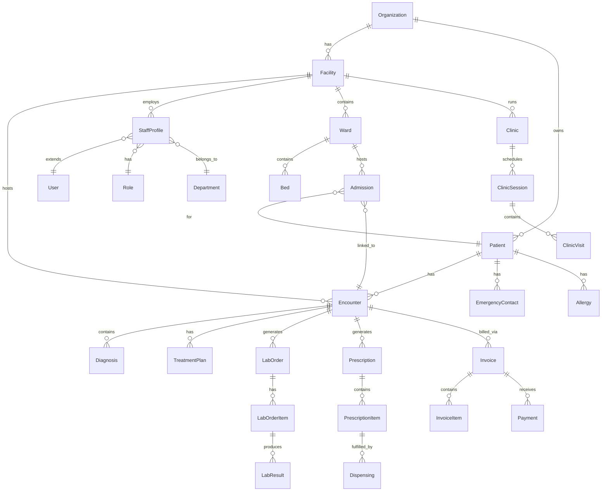
```mermaid
erDiagram
    Organization ||--o{ Facility : has
    Organization ||--o{ Patient : owns
    Facility ||--o{ Encounter : hosts
    Facility ||--o{ StaffProfile : employs
    Facility ||--o{ Ward : contains
    Facility ||--o{ Clinic : runs

    Patient ||--o{ Encounter : has
    Patient ||--o{ EmergencyContact : has
    Patient ||--o{ Allergy : has

    Encounter ||--o{ Diagnosis : contains
    Encounter ||--o{ TreatmentPlan : has
    Encounter ||--o{ LabOrder : generates
    Encounter ||--o{ Prescription : generates
    Encounter ||--o{ Invoice : billed_via

    Ward ||--o{ Bed : contains
    Ward ||--o{ Admission : hosts
    Admission }o--|| Patient : for
    Admission }o--|| Encounter : linked_to

    LabOrder ||--o{ LabOrderItem : has
    LabOrderItem ||--o{ LabResult : produces

    Prescription ||--o{ PrescriptionItem : contains
    PrescriptionItem ||--o{ Dispensing : fulfilled_by

    Invoice ||--o{ InvoiceItem : contains
    Invoice ||--o{ Payment : receives

    StaffProfile }o--|| User : extends
    StaffProfile }o--|| Role : has
    StaffProfile }o--|| Department : belongs_to

    Clinic ||--o{ ClinicSession : schedules
    ClinicSession ||--o{ ClinicVisit : contains
```

---

## 13. Technology Stack Summary

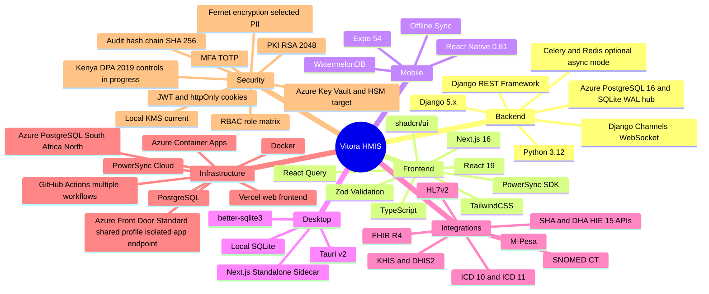
```mermaid
mindmap
  root((Vitora HMIS))
    Backend
      Python 3.12
      Django 5.x
      Django REST Framework
      Celery and Redis optional async mode
      Django Channels WebSocket
      Azure PostgreSQL 16 and SQLite WAL hub
    Frontend
      Next.js 16
      React 19
      TypeScript
      TailwindCSS
      shadcn/ui
      PowerSync SDK
      React Query
      Zod Validation
    Mobile
      React Native 0.81
      Expo 54
      WatermelonDB
      Offline Sync
    Desktop
      Tauri v2
      Next.js Standalone Sidecar
      better-sqlite3
      Local SQLite
    Integrations
      SHA and DHA HIE 15 APIs
      FHIR R4
      HL7v2
      KHIS and DHIS2
      M-Pesa
      SNOMED CT
      ICD 10 and ICD 11
    Infrastructure
      Azure Container Apps
      Azure Front Door Standard shared profile isolated app endpoint
      PostgreSQL
      PowerSync Cloud
      Vercel web frontend
      Azure PostgreSQL South Africa North
      GitHub Actions multiple workflows
      Docker
    Security
      Fernet encryption selected PII
      Local KMS current
      Azure Key Vault and HSM target
      JWT and httpOnly cookies
      MFA TOTP
      RBAC role matrix
      PKI RSA 2048
      Audit hash chain SHA 256
      Kenya DPA 2019 controls in progress
```

---

## 14. Network Topology — Production

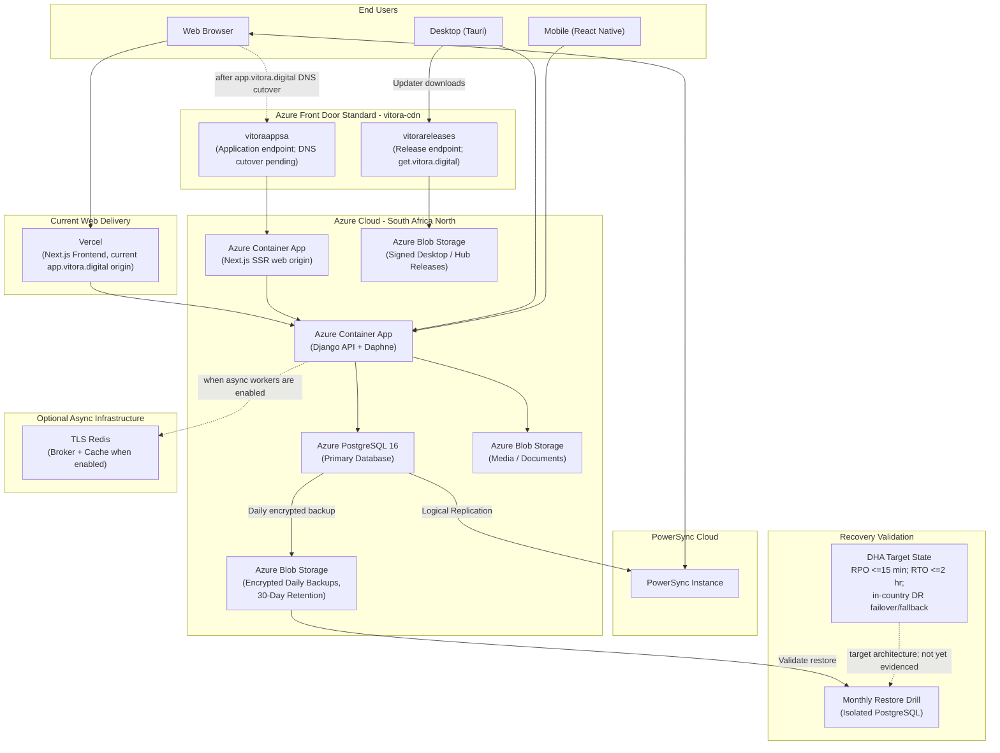
```mermaid
graph TB
    subgraph Users["End Users"]
        BROWSER["Web Browser"]
        TAURI["Desktop (Tauri)"]
        MOBILE_APP["Mobile (React Native)"]
    end

    subgraph CurrentWeb["Current Web Delivery"]
        VERCEL["Vercel<br/>(Next.js Frontend, current app.vitora.digital origin)"]
    end

    subgraph FrontDoor["Azure Front Door Standard - vitora-cdn"]
        AFD_APP["vitoraappsa<br/>(Application endpoint; DNS cutover pending)"]
        AFD_RELEASES["vitorareleases<br/>(Release endpoint; get.vitora.digital)"]
    end

    subgraph Azure["Azure Cloud - South Africa North"]
        ACA["Azure Container App<br/>(Django API + Daphne)"]
        WEB_ACA["Azure Container App<br/>(Next.js SSR web origin)"]
        AZURE_PG["Azure PostgreSQL 16<br/>(Primary Database)"]
        STORAGE["Azure Blob Storage<br/>(Media / Documents)"]
        BACKUPS["Azure Blob Storage<br/>(Encrypted Daily Backups,<br/>30-Day Retention)"]
        RELEASES["Azure Blob Storage<br/>(Signed Desktop / Hub Releases)"]
    end

    subgraph PowerSyncCloud["PowerSync Cloud"]
        PS_INSTANCE["PowerSync Instance"]
    end

    subgraph Async["Optional Async Infrastructure"]
        REDIS_INST["TLS Redis<br/>(Broker + Cache when enabled)"]
    end

    subgraph DR["Recovery Validation"]
        RESTORE["Monthly Restore Drill<br/>(Isolated PostgreSQL)"]
        DHA_TARGET["DHA Target State<br/>RPO <=15 min; RTO <=2 hr;<br/>in-country DR failover/fallback"]
    end

    BROWSER --> VERCEL
    VERCEL --> ACA
    BROWSER -. "after app.vitora.digital DNS cutover" .-> AFD_APP
    AFD_APP --> WEB_ACA
    WEB_ACA --> ACA
    BROWSER <--> PS_INSTANCE
    TAURI --> ACA
    MOBILE_APP --> ACA
    TAURI -->|"Updater downloads"| AFD_RELEASES
    AFD_RELEASES --> RELEASES

    ACA --> AZURE_PG
    ACA -. "when async workers are enabled" .-> REDIS_INST
    ACA --> STORAGE
    AZURE_PG -->|"Logical Replication"| PS_INSTANCE
    AZURE_PG -->|"Daily encrypted backup"| BACKUPS
    BACKUPS -->|"Validate restore"| RESTORE
    DHA_TARGET -. "target architecture; not yet evidenced" .-> RESTORE
```
