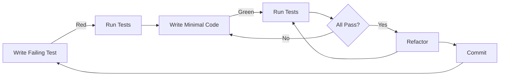

# Test-Driven Development (TDD) Guidelines for Vitora HMIS

**Version**: 1.0
**Last Updated**: December 27, 2025
**Status**: Active

---

## Table of Contents

1. [Introduction](#introduction)
2. [TDD Philosophy](#tdd-philosophy)
3. [The Red-Green-Refactor Cycle](#the-red-green-refactor-cycle)
4. [Test Templates](#test-templates)
5. [Testing Standards](#testing-standards)
6. [Best Practices](#best-practices)
7. [Common Patterns](#common-patterns)
8. [TDD Workflow](#tdd-workflow)
9. [Code Review Checklist](#code-review-checklist)
10. [Troubleshooting](#troubleshooting)

---

## Introduction

This document defines the Test-Driven Development (TDD) approach for Vitora HMIS. TDD is mandatory for all new features and bug fixes. The goal is to ensure high code quality, maintainability, and confidence in our offline-first HMIS.

### Why TDD?

- **Quality Assurance**: Catches bugs early, before they reach production
- **Design Feedback**: Tests force us to think about API design upfront
- **Documentation**: Tests serve as executable documentation
- **Confidence**: Enables safe refactoring and feature additions
- **Coverage**: Ensures 80%+ test coverage organically
- **Kenya Focus**: Critical for offline-first features where failures have real impact

### Core Principle

**ALWAYS write tests BEFORE implementation code.**

---

## TDD Philosophy

### The TDD Mantra

> "Red, Green, Refactor"

1. **Red**: Write a failing test that defines desired functionality
2. **Green**: Write minimal code to make the test pass
3. **Refactor**: Clean up code while keeping tests green

### Test Pyramid

Maintain this distribution:
- **70% Unit Tests**: Fast, isolated, test individual functions/methods
- **20% Integration Tests**: Test component interactions (e.g., API + database)
- **10% End-to-End Tests**: Test complete user workflows

### Coverage Requirements

- **Minimum**: 80% overall coverage (enforced by CI/CD)
- **Target**: 90%+ for critical modules (Patient, Encounter, Security)
- **Exception**: UI code may have lower coverage (focus on logic testing)

---

## The Red-Green-Refactor Cycle

### Step 1: Red (Write Failing Test)

```python
# Example: Test for MRN generation (BEFORE implementation)
import pytest
from hmis.models import Patient
from hmis.utils import generate_mrn

def test_mrn_generation_format():
    """MRN should follow format: KE-{SITE_CODE}-{YYYYMMDD}-{SEQUENCE}"""
    mrn = generate_mrn(site_code="NAI01", date="2026-01-15")

    assert mrn.startswith("KE-NAI01-20260115-")
    assert len(mrn) == 24  # KE-NAI01-20260115-0001
    assert mrn[-4:].isdigit()  # Last 4 chars are sequence number

def test_mrn_uniqueness():
    """Each MRN must be globally unique"""
    mrn1 = generate_mrn(site_code="NAI01")
    mrn2 = generate_mrn(site_code="NAI01")

    assert mrn1 != mrn2

def test_mrn_persistence():
    """MRN should be stored in database"""
    patient = Patient.objects.create(
        first_name="John",
        last_name="Doe",
        date_of_birth="1990-01-01"
    )

    assert patient.mrn is not None
    assert patient.mrn.startswith("KE-")
```

**Run**: `make test` → Tests should FAIL (function doesn't exist yet)

### Step 2: Green (Make Tests Pass)

```python
# hmis/utils.py - Implement minimal code to pass tests
from datetime import datetime
from django.db import transaction

def generate_mrn(site_code: str, date: str = None) -> str:
    """
    Generate unique Medical Record Number.

    Format: KE-{SITE_CODE}-{YYYYMMDD}-{SEQUENCE}
    Example: KE-NAI01-20260115-0001
    """
    if date is None:
        date = datetime.now().strftime("%Y%m%d")
    else:
        date = datetime.strptime(date, "%Y-%m-%d").strftime("%Y%m%d")

    with transaction.atomic():
        # Get next sequence number for this site+date
        from hmis.models import MRNSequence
        seq = MRNSequence.objects.select_for_update().get_or_create(
            site_code=site_code,
            date=date
        )[0]
        seq.sequence += 1
        seq.save()

        sequence_str = str(seq.sequence).zfill(4)

    return f"KE-{site_code}-{date}-{sequence_str}"
```

**Run**: `make test` → Tests should PASS ✅

### Step 3: Refactor (Improve Code)

```python
# Refactor: Extract constants, improve readability
from datetime import datetime
from django.db import transaction
from typing import Optional

MRN_FORMAT = "KE-{site_code}-{date}-{sequence}"
MRN_SEQUENCE_LENGTH = 4

def generate_mrn(site_code: str, date: Optional[str] = None) -> str:
    """
    Generate unique Medical Record Number following Kenya HMIS standard.

    Args:
        site_code: Facility code (e.g., "NAI01" for Nairobi site 1)
        date: Optional date string in YYYY-MM-DD format (defaults to today)

    Returns:
        str: Unique MRN in format KE-{SITE_CODE}-{YYYYMMDD}-{SEQUENCE}

    Examples:
        >>> generate_mrn("NAI01", "2026-01-15")
        'KE-NAI01-20260115-0001'
    """
    date_str = _format_date(date)
    sequence = _get_next_sequence(site_code, date_str)

    return MRN_FORMAT.format(
        site_code=site_code,
        date=date_str,
        sequence=str(sequence).zfill(MRN_SEQUENCE_LENGTH)
    )

def _format_date(date: Optional[str]) -> str:
    """Convert date to YYYYMMDD format."""
    if date is None:
        return datetime.now().strftime("%Y%m%d")
    return datetime.strptime(date, "%Y-%m-%d").strftime("%Y%m%d")

def _get_next_sequence(site_code: str, date_str: str) -> int:
    """Get next sequence number for given site and date."""
    with transaction.atomic():
        from hmis.models import MRNSequence
        seq, _ = MRNSequence.objects.select_for_update().get_or_create(
            site_code=site_code,
            date=date_str
        )
        seq.sequence += 1
        seq.save()
        return seq.sequence
```

**Run**: `make test` → Tests should STILL PASS ✅

---

## Test Templates

### Template 1: Django Model Test

```python
# tests/models/test_patient.py
import pytest
from django.core.exceptions import ValidationError
from django.db import IntegrityError
from hmis.models import Patient

@pytest.mark.django_db
class TestPatientModel:
    """Test suite for Patient model."""

    def test_create_patient_with_required_fields(self):
        """Patient can be created with minimum required fields."""
        patient = Patient.objects.create(
            first_name="Jane",
            last_name="Doe",
            date_of_birth="1985-05-20",
            gender="F"
        )

        assert patient.id is not None
        assert patient.mrn is not None
        assert patient.created_at is not None

    def test_mrn_auto_generated_on_save(self):
        """MRN is automatically generated when patient is saved."""
        patient = Patient(
            first_name="John",
            last_name="Smith",
            date_of_birth="1990-01-01",
            gender="M"
        )
        assert patient.mrn is None  # Before save

        patient.save()
        assert patient.mrn is not None  # After save
        assert patient.mrn.startswith("KE-")

    def test_mrn_uniqueness(self):
        """MRN must be unique across all patients."""
        patient1 = Patient.objects.create(
            first_name="Patient",
            last_name="One",
            date_of_birth="1990-01-01",
            gender="M"
        )

        # Attempting to create patient with same MRN should fail
        with pytest.raises(IntegrityError):
            Patient.objects.create(
                first_name="Patient",
                last_name="Two",
                date_of_birth="1990-01-01",
                gender="F",
                mrn=patient1.mrn
            )

    def test_patient_age_calculation(self):
        """Patient age is correctly calculated from date_of_birth."""
        from datetime import date
        patient = Patient.objects.create(
            first_name="Age",
            last_name="Test",
            date_of_birth=date(2000, 1, 1),
            gender="M"
        )

        # Age as of 2026-01-15
        expected_age = 26
        assert patient.age == expected_age

    def test_sensitive_data_flag(self):
        """Patients can be flagged as having sensitive data."""
        patient = Patient.objects.create(
            first_name="Sensitive",
            last_name="Case",
            date_of_birth="1990-01-01",
            gender="F",
            is_sensitive=True
        )

        assert patient.is_sensitive is True

    def test_patient_str_representation(self):
        """Patient string representation includes name and MRN."""
        patient = Patient.objects.create(
            first_name="John",
            last_name="Doe",
            date_of_birth="1990-01-01",
            gender="M"
        )

        str_repr = str(patient)
        assert "John Doe" in str_repr
        assert patient.mrn in str_repr

    @pytest.mark.parametrize("gender", ["M", "F", "O", "U"])
    def test_valid_gender_choices(self, gender):
        """Patient accepts valid gender choices."""
        patient = Patient.objects.create(
            first_name="Test",
            last_name="Gender",
            date_of_birth="1990-01-01",
            gender=gender
        )

        assert patient.gender == gender

    def test_invalid_gender_raises_error(self):
        """Invalid gender choice raises ValidationError."""
        patient = Patient(
            first_name="Invalid",
            last_name="Gender",
            date_of_birth="1990-01-01",
            gender="X"  # Invalid choice
        )

        with pytest.raises(ValidationError):
            patient.full_clean()
```

### Template 2: Django REST API Test

```python
# tests/api/test_patient_api.py
import pytest
from rest_framework.test import APIClient
from rest_framework import status
from django.contrib.auth import get_user_model
from hmis.models import Patient

User = get_user_model()

@pytest.mark.django_db
class TestPatientAPI:
    """Test suite for Patient API endpoints."""

    @pytest.fixture
    def api_client(self):
        """Provide authenticated API client."""
        return APIClient()

    @pytest.fixture
    def authenticated_user(self):
        """Create and return authenticated user."""
        user = User.objects.create_user(
            username="testdoctor",
            email="doctor@test.com",
            password="testpass123"
        )
        return user

    @pytest.fixture
    def auth_client(self, api_client, authenticated_user):
        """Provide API client with authentication."""
        api_client.force_authenticate(user=authenticated_user)
        return api_client

    def test_create_patient_success(self, auth_client):
        """Authenticated user can create a patient."""
        data = {
            "first_name": "Jane",
            "last_name": "Doe",
            "date_of_birth": "1990-05-15",
            "gender": "F",
            "phone_number": "+254712345678"
        }

        response = auth_client.post("/api/v1/patients/", data, format="json")

        assert response.status_code == status.HTTP_201_CREATED
        assert response.data["first_name"] == "Jane"
        assert response.data["mrn"] is not None
        assert "id" in response.data

    def test_create_patient_unauthenticated(self, api_client):
        """Unauthenticated request returns 401."""
        data = {
            "first_name": "Jane",
            "last_name": "Doe",
            "date_of_birth": "1990-05-15",
            "gender": "F"
        }

        response = api_client.post("/api/v1/patients/", data, format="json")
        assert response.status_code == status.HTTP_401_UNAUTHORIZED

    def test_create_patient_missing_required_fields(self, auth_client):
        """Creating patient without required fields returns 400."""
        data = {
            "first_name": "Jane"
            # Missing: last_name, date_of_birth, gender
        }

        response = auth_client.post("/api/v1/patients/", data, format="json")

        assert response.status_code == status.HTTP_400_BAD_REQUEST
        assert "last_name" in response.data
        assert "date_of_birth" in response.data
        assert "gender" in response.data

    def test_list_patients(self, auth_client):
        """Authenticated user can list patients."""
        # Create test patients
        Patient.objects.create(
            first_name="Patient", last_name="One",
            date_of_birth="1990-01-01", gender="M"
        )
        Patient.objects.create(
            first_name="Patient", last_name="Two",
            date_of_birth="1985-05-20", gender="F"
        )

        response = auth_client.get("/api/v1/patients/")

        assert response.status_code == status.HTTP_200_OK
        assert len(response.data["results"]) == 2

    def test_retrieve_patient_by_id(self, auth_client):
        """Authenticated user can retrieve patient by ID."""
        patient = Patient.objects.create(
            first_name="John", last_name="Doe",
            date_of_birth="1990-01-01", gender="M"
        )

        response = auth_client.get(f"/api/v1/patients/{patient.id}/")

        assert response.status_code == status.HTTP_200_OK
        assert response.data["id"] == patient.id
        assert response.data["mrn"] == patient.mrn

    def test_search_patient_by_mrn(self, auth_client):
        """Authenticated user can search patient by MRN."""
        patient = Patient.objects.create(
            first_name="Search", last_name="Test",
            date_of_birth="1990-01-01", gender="M"
        )

        response = auth_client.get(f"/api/v1/patients/?mrn={patient.mrn}")

        assert response.status_code == status.HTTP_200_OK
        assert len(response.data["results"]) == 1
        assert response.data["results"][0]["mrn"] == patient.mrn

    def test_update_patient(self, auth_client):
        """Authenticated user can update patient details."""
        patient = Patient.objects.create(
            first_name="Old", last_name="Name",
            date_of_birth="1990-01-01", gender="M"
        )

        update_data = {
            "first_name": "New",
            "last_name": "Name",
            "date_of_birth": "1990-01-01",
            "gender": "M"
        }

        response = auth_client.put(
            f"/api/v1/patients/{patient.id}/",
            update_data,
            format="json"
        )

        assert response.status_code == status.HTTP_200_OK
        assert response.data["first_name"] == "New"

    def test_cannot_update_mrn(self, auth_client):
        """MRN cannot be changed after creation."""
        patient = Patient.objects.create(
            first_name="Test", last_name="Patient",
            date_of_birth="1990-01-01", gender="M"
        )
        original_mrn = patient.mrn

        update_data = {
            "first_name": "Test",
            "last_name": "Patient",
            "date_of_birth": "1990-01-01",
            "gender": "M",
            "mrn": "KE-FAKE-20260101-9999"
        }

        response = auth_client.put(
            f"/api/v1/patients/{patient.id}/",
            update_data,
            format="json"
        )

        patient.refresh_from_db()
        assert patient.mrn == original_mrn  # MRN unchanged
```

### Template 3: Utility Function Test

```python
# tests/utils/test_validators.py
import pytest
from hmis.utils.validators import (
    validate_kenyan_phone,
    validate_national_id,
    validate_vital_signs
)
from django.core.exceptions import ValidationError

class TestKenyanPhoneValidator:
    """Test suite for Kenyan phone number validation."""

    @pytest.mark.parametrize("phone_number", [
        "+254712345678",
        "+254722345678",
        "+254733345678",
        "0712345678",
        "0722345678",
    ])
    def test_valid_kenyan_phone_numbers(self, phone_number):
        """Valid Kenyan phone numbers pass validation."""
        # Should not raise exception
        validate_kenyan_phone(phone_number)

    @pytest.mark.parametrize("phone_number,expected_error", [
        ("+255712345678", "must start with +254"),
        ("+2547123456", "must be 13 characters"),
        ("071234567890", "invalid format"),
        ("invalid", "invalid format"),
        ("", "cannot be empty"),
    ])
    def test_invalid_kenyan_phone_numbers(self, phone_number, expected_error):
        """Invalid phone numbers raise ValidationError."""
        with pytest.raises(ValidationError) as exc_info:
            validate_kenyan_phone(phone_number)

        assert expected_error in str(exc_info.value).lower()

class TestVitalSignsValidator:
    """Test suite for vital signs validation."""

    def test_valid_vital_signs(self):
        """Valid vital signs pass validation."""
        vitals = {
            "temperature": 36.5,
            "systolic_bp": 120,
            "diastolic_bp": 80,
            "heart_rate": 75,
            "respiratory_rate": 16,
            "oxygen_saturation": 98
        }

        # Should not raise exception
        validate_vital_signs(vitals)

    def test_temperature_out_of_range(self):
        """Temperature outside safe range raises ValidationError."""
        vitals = {
            "temperature": 45.0,  # Dangerously high
            "systolic_bp": 120,
            "diastolic_bp": 80,
            "heart_rate": 75
        }

        with pytest.raises(ValidationError) as exc_info:
            validate_vital_signs(vitals)

        assert "temperature" in str(exc_info.value).lower()

    def test_blood_pressure_validation(self):
        """Systolic BP must be greater than diastolic BP."""
        vitals = {
            "temperature": 36.5,
            "systolic_bp": 80,   # Lower than diastolic
            "diastolic_bp": 120,  # Higher than systolic
            "heart_rate": 75
        }

        with pytest.raises(ValidationError) as exc_info:
            validate_vital_signs(vitals)

        assert "systolic" in str(exc_info.value).lower()
        assert "diastolic" in str(exc_info.value).lower()
```

### Template 4: Integration Test

```python
# tests/integration/test_patient_workflow.py
import pytest
from rest_framework.test import APIClient
from rest_framework import status
from django.contrib.auth import get_user_model
from hmis.models import Patient, Encounter

User = get_user_model()

@pytest.mark.django_db
@pytest.mark.integration
class TestPatientWorkflow:
    """Integration tests for complete patient workflows."""

    @pytest.fixture
    def setup_environment(self):
        """Set up test environment with users and auth."""
        user = User.objects.create_user(
            username="testdoctor",
            email="doctor@test.com",
            password="testpass123"
        )
        client = APIClient()
        client.force_authenticate(user=user)

        return {"user": user, "client": client}

    def test_complete_patient_registration_and_encounter(self, setup_environment):
        """Test complete flow: Register patient → Create encounter → Record vitals."""
        client = setup_environment["client"]
        user = setup_environment["user"]

        # Step 1: Register new patient
        patient_data = {
            "first_name": "Jane",
            "last_name": "Doe",
            "date_of_birth": "1990-05-15",
            "gender": "F",
            "phone_number": "+254712345678"
        }

        response = client.post("/api/v1/patients/", patient_data, format="json")
        assert response.status_code == status.HTTP_201_CREATED
        patient_id = response.data["id"]
        patient_mrn = response.data["mrn"]

        # Step 2: Create encounter for patient
        encounter_data = {
            "patient": patient_id,
            "encounter_type": "outpatient",
            "chief_complaint": "Fever and headache",
            "provider": user.id
        }

        response = client.post("/api/v1/encounters/", encounter_data, format="json")
        assert response.status_code == status.HTTP_201_CREATED
        encounter_id = response.data["id"]

        # Step 3: Record vital signs
        vitals_data = {
            "encounter": encounter_id,
            "temperature": 38.5,
            "systolic_bp": 120,
            "diastolic_bp": 80,
            "heart_rate": 85,
            "respiratory_rate": 18,
            "oxygen_saturation": 97
        }

        response = client.post("/api/v1/vitals/", vitals_data, format="json")
        assert response.status_code == status.HTTP_201_CREATED

        # Step 4: Verify data integrity
        patient = Patient.objects.get(id=patient_id)
        assert patient.mrn == patient_mrn

        encounter = Encounter.objects.get(id=encounter_id)
        assert encounter.patient == patient
        assert encounter.vitals.count() == 1
        assert encounter.vitals.first().temperature == 38.5
```

### Template 5: Fixture Factory

```python
# tests/factories.py
import factory
from factory.django import DjangoModelFactory
from faker import Faker
from hmis.models import Patient, Encounter
from django.contrib.auth import get_user_model

fake = Faker()
User = get_user_model()

class UserFactory(DjangoModelFactory):
    """Factory for creating test users."""

    class Meta:
        model = User

    username = factory.Sequence(lambda n: f"user{n}")
    email = factory.LazyAttribute(lambda obj: f"{obj.username}@test.com")
    password = factory.PostGenerationMethodCall('set_password', 'testpass123')
    first_name = factory.Faker('first_name')
    last_name = factory.Faker('last_name')

class PatientFactory(DjangoModelFactory):
    """Factory for creating test patients."""

    class Meta:
        model = Patient

    first_name = factory.Faker('first_name')
    last_name = factory.Faker('last_name')
    date_of_birth = factory.Faker('date_of_birth', minimum_age=0, maximum_age=100)
    gender = factory.Faker('random_element', elements=["M", "F", "O", "U"])
    phone_number = factory.Sequence(lambda n: f"+2547{n:08d}")
    national_id = factory.Sequence(lambda n: f"{n:08d}")
    is_sensitive = False

class EncounterFactory(DjangoModelFactory):
    """Factory for creating test encounters."""

    class Meta:
        model = Encounter

    patient = factory.SubFactory(PatientFactory)
    provider = factory.SubFactory(UserFactory)
    encounter_type = factory.Faker('random_element', elements=["outpatient", "inpatient", "emergency"])
    chief_complaint = factory.Faker('sentence')

# Usage in tests:
# patient = PatientFactory()
# patient = PatientFactory(first_name="John", is_sensitive=True)
# patients = PatientFactory.create_batch(10)
```

---

## Testing Standards

### Naming Conventions

**Test Files**:
- Pattern: `test_*.py` or `*_test.py`
- Example: `test_patient_model.py`, `test_patient_api.py`

**Test Functions/Methods**:
- Pattern: `test_<what_is_being_tested>`
- Be descriptive: `test_mrn_generation_with_invalid_site_code`
- Bad: `test_patient`, `test_1`, `test_something`
- Good: `test_patient_creation_with_required_fields`, `test_patient_age_calculation`

**Test Classes**:
- Pattern: `Test<ComponentName>`
- Example: `TestPatientModel`, `TestPatientAPI`, `TestMRNGeneration`

### Test Organization

```
backend/tests/
├── __init__.py
├── conftest.py              # Shared fixtures
├── factories.py             # Factory Boy factories
├── models/
│   ├── __init__.py
│   ├── test_patient.py
│   ├── test_encounter.py
│   └── test_vital_signs.py
├── api/
│   ├── __init__.py
│   ├── test_patient_api.py
│   ├── test_encounter_api.py
│   └── test_auth.py
├── utils/
│   ├── __init__.py
│   ├── test_validators.py
│   └── test_mrn_generation.py
├── integration/
│   ├── __init__.py
│   └── test_patient_workflow.py
└── e2e/
    ├── __init__.py
    └── test_patient_registration.py
```

### Test Markers

Use pytest markers to categorize tests:

```python
import pytest

@pytest.mark.unit
def test_patient_model():
    """Unit test for patient model."""
    pass

@pytest.mark.integration
def test_patient_api_workflow():
    """Integration test for patient API."""
    pass

@pytest.mark.e2e
def test_complete_patient_journey():
    """End-to-end test for patient journey."""
    pass

@pytest.mark.slow
def test_bulk_patient_import():
    """Slow test (>1 second)."""
    pass

@pytest.mark.django_db
def test_database_operation():
    """Test that requires database access."""
    pass
```

**Run specific markers**:
```bash
make test-unit        # Run only unit tests
make test-integration # Run only integration tests
make test-slow        # Run slow tests
```

### Assertion Standards

**Use descriptive assertions**:

```python
# ❌ Bad
assert patient.mrn

# ✅ Good
assert patient.mrn is not None, "MRN should be auto-generated on save"
assert patient.mrn.startswith("KE-"), f"MRN should start with 'KE-', got {patient.mrn}"
```

**Use pytest's assertion introspection**:

```python
# pytest provides detailed output automatically
assert response.status_code == 200
assert "error" not in response.data
assert len(patients) == 5
```

**Use pytest.raises for exceptions**:

```python
# ❌ Bad
try:
    validate_mrn("invalid")
    assert False, "Should have raised ValidationError"
except ValidationError:
    pass

# ✅ Good
with pytest.raises(ValidationError) as exc_info:
    validate_mrn("invalid")

assert "format" in str(exc_info.value).lower()
```

---

## Best Practices

### 1. Test Independence

Each test should be independent and able to run in any order.

```python
# ❌ Bad - Tests depend on each other
def test_create_patient():
    global patient_id
    patient = Patient.objects.create(...)
    patient_id = patient.id

def test_update_patient():
    # Depends on test_create_patient
    patient = Patient.objects.get(id=patient_id)
    ...

# ✅ Good - Tests are independent
@pytest.fixture
def patient():
    return Patient.objects.create(...)

def test_create_patient():
    patient = Patient.objects.create(...)
    assert patient.id is not None

def test_update_patient(patient):
    # Uses fixture, independent of other tests
    patient.first_name = "Updated"
    patient.save()
    assert patient.first_name == "Updated"
```

### 2. Use Fixtures for Setup

```python
# ❌ Bad - Duplicate setup code
def test_patient_api_1():
    user = User.objects.create_user(...)
    client = APIClient()
    client.force_authenticate(user=user)
    # Test code...

def test_patient_api_2():
    user = User.objects.create_user(...)
    client = APIClient()
    client.force_authenticate(user=user)
    # Test code...

# ✅ Good - Shared fixture
@pytest.fixture
def auth_client():
    user = User.objects.create_user(...)
    client = APIClient()
    client.force_authenticate(user=user)
    return client

def test_patient_api_1(auth_client):
    response = auth_client.get("/api/patients/")
    ...

def test_patient_api_2(auth_client):
    response = auth_client.post("/api/patients/", data)
    ...
```

### 3. Test One Thing at a Time

```python
# ❌ Bad - Testing multiple things
def test_patient():
    patient = Patient.objects.create(...)
    assert patient.id is not None
    assert patient.mrn is not None
    assert patient.age == 26
    assert str(patient) == "John Doe (KE-...)"

    # Also testing update
    patient.first_name = "Jane"
    patient.save()
    assert patient.first_name == "Jane"

# ✅ Good - Separate tests
def test_patient_creation():
    patient = Patient.objects.create(...)
    assert patient.id is not None

def test_patient_mrn_generation():
    patient = Patient.objects.create(...)
    assert patient.mrn is not None
    assert patient.mrn.startswith("KE-")

def test_patient_age_calculation():
    patient = Patient.objects.create(date_of_birth="2000-01-01")
    assert patient.age == 26

def test_patient_string_representation():
    patient = Patient.objects.create(first_name="John", last_name="Doe")
    assert "John Doe" in str(patient)

def test_patient_update():
    patient = Patient.objects.create(first_name="John")
    patient.first_name = "Jane"
    patient.save()
    assert patient.first_name == "Jane"
```

### 4. Use Parameterized Tests for Similar Cases

```python
# ❌ Bad - Duplicate test code
def test_valid_gender_m():
    patient = Patient.objects.create(gender="M", ...)
    assert patient.gender == "M"

def test_valid_gender_f():
    patient = Patient.objects.create(gender="F", ...)
    assert patient.gender == "F"

def test_valid_gender_o():
    patient = Patient.objects.create(gender="O", ...)
    assert patient.gender == "O"

# ✅ Good - Parameterized test
@pytest.mark.parametrize("gender", ["M", "F", "O", "U"])
def test_valid_gender_choices(gender):
    patient = Patient.objects.create(
        first_name="Test",
        last_name="Patient",
        date_of_birth="1990-01-01",
        gender=gender
    )
    assert patient.gender == gender
```

### 5. Mock External Dependencies

```python
# ❌ Bad - Test depends on external service
def test_send_patient_notification():
    patient = Patient.objects.create(...)
    result = send_sms_notification(patient.phone_number, "Welcome")
    assert result.success  # Fails if SMS service is down

# ✅ Good - Mock external service
from unittest.mock import patch

def test_send_patient_notification():
    patient = Patient.objects.create(...)

    with patch('hmis.utils.sms.send_sms') as mock_sms:
        mock_sms.return_value = {"success": True}

        result = send_sms_notification(patient.phone_number, "Welcome")

        assert result["success"]
        mock_sms.assert_called_once_with(
            patient.phone_number,
            "Welcome"
        )
```

### 6. Test Edge Cases and Error Conditions

```python
def test_patient_age_calculation():
    """Test age calculation for various scenarios."""
    from datetime import date

    # Happy path
    patient = Patient.objects.create(date_of_birth=date(2000, 1, 1))
    assert patient.age == 26

    # Edge case: Born today
    patient_today = Patient.objects.create(date_of_birth=date.today())
    assert patient_today.age == 0

    # Edge case: Very old patient
    patient_old = Patient.objects.create(date_of_birth=date(1900, 1, 1))
    assert patient_old.age == 126

    # Error case: Future date
    with pytest.raises(ValidationError):
        Patient.objects.create(date_of_birth=date(2030, 1, 1))
```

### 7. Use Descriptive Test Names

```python
# ❌ Bad
def test_patient():
    ...

def test_patient_2():
    ...

def test_error():
    ...

# ✅ Good
def test_patient_creation_with_required_fields_succeeds():
    ...

def test_patient_creation_without_last_name_raises_validation_error():
    ...

def test_patient_mrn_is_auto_generated_on_first_save():
    ...
```

---

## Common Patterns

### Pattern 1: Arrange-Act-Assert (AAA)

```python
def test_patient_creation():
    # Arrange - Set up test data
    patient_data = {
        "first_name": "John",
        "last_name": "Doe",
        "date_of_birth": "1990-01-01",
        "gender": "M"
    }

    # Act - Perform the action
    patient = Patient.objects.create(**patient_data)

    # Assert - Verify the result
    assert patient.id is not None
    assert patient.first_name == "John"
    assert patient.mrn is not None
```

### Pattern 2: Given-When-Then (BDD Style)

```python
def test_patient_search_by_mrn_returns_correct_patient():
    # Given: A patient exists in the database
    patient = Patient.objects.create(
        first_name="John",
        last_name="Doe",
        date_of_birth="1990-01-01",
        gender="M"
    )
    mrn = patient.mrn

    # When: We search for the patient by MRN
    found_patient = Patient.objects.get(mrn=mrn)

    # Then: The correct patient is returned
    assert found_patient.id == patient.id
    assert found_patient.first_name == "John"
```

### Pattern 3: Test Fixtures for Complex Setup

```python
@pytest.fixture
def patient_with_encounters():
    """Create patient with multiple encounters."""
    patient = PatientFactory()
    encounters = EncounterFactory.create_batch(3, patient=patient)
    return {"patient": patient, "encounters": encounters}

def test_patient_encounter_count(patient_with_encounters):
    patient = patient_with_encounters["patient"]
    assert patient.encounters.count() == 3
```

### Pattern 4: Snapshot Testing for API Responses

```python
def test_patient_api_response_structure(auth_client, snapshot):
    """Verify API response structure hasn't changed."""
    patient = PatientFactory()
    response = auth_client.get(f"/api/v1/patients/{patient.id}/")

    # Remove dynamic fields
    data = response.data.copy()
    data.pop("id")
    data.pop("mrn")
    data.pop("created_at")
    data.pop("updated_at")

    # Compare to snapshot
    assert data == snapshot
```

---

## TDD Workflow

### Daily TDD Cycle



### Step-by-Step Workflow

1. **Start a new feature**
   ```bash
   git checkout -b feature/patient-consent-tracking
   ```

2. **Write test first** (Red)
   ```python
   # tests/models/test_patient.py
   def test_patient_consent_can_be_recorded():
       """Patient can record consent for data sharing."""
       patient = Patient.objects.create(...)

       consent = PatientConsent.objects.create(
           patient=patient,
           consent_type="data_sharing",
           consented=True,
           consented_at=timezone.now()
       )

       assert consent.patient == patient
       assert consent.consented is True
   ```

3. **Run tests** (should fail)
   ```bash
   make test
   # ERROR: ImportError: cannot import name 'PatientConsent'
   ```

4. **Write minimal code** (Green)
   ```python
   # hmis/models/patient_consent.py
   from django.db import models
   from hmis.models import Patient

   class PatientConsent(models.Model):
       patient = models.ForeignKey(Patient, on_delete=models.CASCADE)
       consent_type = models.CharField(max_length=50)
       consented = models.BooleanField()
       consented_at = models.DateTimeField()
   ```

5. **Run tests again** (should pass)
   ```bash
   make test
   # ✅ All tests passed
   ```

6. **Refactor** (if needed)
   ```python
   # Add choices, validation, etc.
   class PatientConsent(models.Model):
       CONSENT_TYPES = [
           ('data_sharing', 'Data Sharing'),
           ('research', 'Research Participation'),
           ('marketing', 'Marketing Communications'),
       ]

       patient = models.ForeignKey(
           Patient,
           on_delete=models.CASCADE,
           related_name='consents'
       )
       consent_type = models.CharField(
           max_length=50,
           choices=CONSENT_TYPES
       )
       consented = models.BooleanField(default=False)
       consented_at = models.DateTimeField(auto_now_add=True)

       class Meta:
           unique_together = ('patient', 'consent_type')
   ```

7. **Run tests again** (should still pass)
   ```bash
   make test
   # ✅ All tests still passed
   ```

8. **Run linters**
   ```bash
   make lint
   make format
   ```

9. **Commit**
   ```bash
   git add .
   git commit -m "feat: Add patient consent tracking model

   - Add PatientConsent model with consent types
   - Implement consent recording functionality
   - Add tests for consent creation and validation

   Tests: 15 passed
   Coverage: 92%"
   ```

10. **Push and create PR**
    ```bash
    git push origin feature/patient-consent-tracking
    # Create PR on GitHub
    ```

### Pre-Commit Checklist

Before committing, ensure:
- [ ] All tests pass (`make test`)
- [ ] Code coverage ≥80% (`make coverage`)
- [ ] Linters pass (`make lint`)
- [ ] Code formatted (`make format`)
- [ ] Type checks pass (`make type-check`)
- [ ] Security scan clean (`make security`)
- [ ] Documentation updated (if needed)
- [ ] Commit message follows conventions

**Quick command**: `make pre-commit`

---

## Code Review Checklist

### For Code Authors

Before requesting review:
- [ ] All tests pass locally
- [ ] CI/CD pipeline passes
- [ ] Test coverage ≥80%
- [ ] Tests follow TDD templates
- [ ] Tests are independent
- [ ] Tests have descriptive names
- [ ] Edge cases covered
- [ ] Error conditions tested
- [ ] No skipped/disabled tests without reason
- [ ] Documentation updated

### For Code Reviewers

When reviewing PRs, check:
- [ ] **Tests first**: Are there tests for all new functionality?
- [ ] **Test quality**: Do tests actually test what they claim?
- [ ] **Coverage**: Is coverage ≥80%?
- [ ] **Independence**: Can tests run in any order?
- [ ] **Clarity**: Are test names descriptive?
- [ ] **Completeness**: Are edge cases and errors covered?
- [ ] **No test smells**: No test interdependencies, no hardcoded data
- [ ] **Fixtures**: Are fixtures properly used?
- [ ] **Performance**: Are there any slow tests that should be marked?
- [ ] **Documentation**: Are complex tests documented?

### Common Test Code Smells

❌ **Test Interdependence**
```python
def test_create():
    global user_id
    user_id = create_user()

def test_update():
    update_user(user_id)  # Depends on test_create
```

❌ **Hardcoded Test Data**
```python
def test_patient():
    patient = Patient.objects.get(id=123)  # Assumes data exists
```

❌ **Testing Implementation Instead of Behavior**
```python
def test_patient_save_calls_generate_mrn():
    # Tests internal implementation detail
    with patch('hmis.models.patient.generate_mrn') as mock:
        patient.save()
        mock.assert_called_once()
```

❌ **Overly Complex Tests**
```python
def test_patient_workflow():
    # 100+ lines of test code testing multiple things
    ...
```

❌ **No Assertions**
```python
def test_patient_creation():
    patient = Patient.objects.create(...)
    # No assertions!
```

✅ **Good Test**
```python
@pytest.mark.django_db
def test_patient_age_calculation_for_adult():
    """Patient age is correctly calculated for adults."""
    from datetime import date

    # Arrange
    birth_date = date(1990, 1, 1)
    patient = Patient.objects.create(
        first_name="Test",
        last_name="Patient",
        date_of_birth=birth_date,
        gender="M"
    )

    # Act
    age = patient.age

    # Assert
    expected_age = 36  # As of 2026
    assert age == expected_age, f"Expected age {expected_age}, got {age}"
```

---

## Troubleshooting

### Issue: Tests Fail Intermittently

**Symptom**: Tests pass sometimes, fail other times.

**Likely Causes**:
1. Test interdependence (tests modify shared state)
2. Time-dependent tests (e.g., `datetime.now()`)
3. Race conditions in parallel tests

**Solutions**:
```python
# ❌ Bad - Time-dependent
def test_patient_created_today():
    patient = Patient.objects.create(...)
    assert patient.created_at.date() == date.today()

# ✅ Good - Freezegun for time control
from freezegun import freeze_time

@freeze_time("2026-01-15")
def test_patient_created_on_specific_date():
    patient = Patient.objects.create(...)
    assert patient.created_at.date() == date(2026, 1, 15)
```

### Issue: Slow Tests

**Symptom**: Test suite takes too long to run.

**Solutions**:
1. **Mark slow tests**: Use `@pytest.mark.slow`
2. **Use pytest-xdist**: Run tests in parallel
   ```bash
   pytest -n auto  # Auto-detect CPU count
   ```
3. **Optimize database usage**: Use transactions
   ```python
   @pytest.mark.django_db(transaction=True)
   def test_something():
       ...
   ```
4. **Mock external services**: Don't make real HTTP calls
5. **Use factories**: Faster than full model creation

### Issue: Low Test Coverage

**Symptom**: Coverage below 80%.

**Solutions**:
1. **Identify gaps**: `make coverage-html` and open `htmlcov/index.html`
2. **Focus on critical paths**: Patient, Encounter, Security
3. **Test edge cases**: Empty inputs, max values, error conditions
4. **Add integration tests**: Cover component interactions

### Issue: Flaky Django Database Tests

**Symptom**: `DatabaseError: no such table` or similar.

**Solution**:
```python
# Always use @pytest.mark.django_db for database tests
@pytest.mark.django_db
def test_patient_creation():
    patient = Patient.objects.create(...)
    assert patient.id is not None
```

### Issue: Test Fixtures Not Working

**Symptom**: `fixture 'my_fixture' not found`.

**Solutions**:
1. **Check conftest.py location**: Must be in test directory or parent
2. **Check fixture scope**: Ensure scope matches usage
3. **Check import**: Fixtures auto-discovered, don't import

```python
# conftest.py
@pytest.fixture
def my_fixture():
    return "value"

# test_file.py
def test_something(my_fixture):  # Auto-injected
    assert my_fixture == "value"
```

---

## Summary

### TDD Commandments

1. **Thou shalt write tests first** - Always Red → Green → Refactor
2. **Thou shalt maintain 80%+ coverage** - Enforced by CI/CD
3. **Thou shalt test one thing** - Single responsibility per test
4. **Thou shalt make tests independent** - No shared state
5. **Thou shalt use descriptive names** - Self-documenting tests
6. **Thou shalt test edge cases** - Happy path + errors
7. **Thou shalt mock external dependencies** - Fast, reliable tests
8. **Thou shalt refactor with confidence** - Green tests enable refactoring
9. **Thou shalt review tests** - Tests are code too
10. **Thou shalt never skip tests** - Quality is non-negotiable

### Quick Reference Card

```bash
# Run all tests
make test

# Run specific tests
pytest tests/models/test_patient.py
pytest tests/models/test_patient.py::test_mrn_generation
pytest -k "patient and mrn"

# Run with coverage
make coverage
make coverage-html

# Run only unit tests
make test-unit

# Run only integration tests
make test-integration

# Run in parallel (faster)
pytest -n auto

# Run and stop at first failure
pytest -x

# Show print statements
pytest -s

# Verbose mode
pytest -v

# Run tests modified since last commit
pytest --testmon

# Watch mode (rerun on file changes)
ptw  # pytest-watch
```

### Resources

- [Pytest Documentation](https://docs.pytest.org/)
- [Django Testing Documentation](https://docs.djangoproject.com/en/5.0/topics/testing/)
- [Test-Driven Development by Kent Beck](https://www.amazon.com/Test-Driven-Development-Kent-Beck/dp/0321146530)
- [Growing Object-Oriented Software, Guided by Tests](https://www.amazon.com/Growing-Object-Oriented-Software-Guided-Tests/dp/0321503627)

---

**Document Owner**: Engineering Team
**Last Review**: December 27, 2025
**Next Review**: March 1, 2026
**Questions?**: Contact @engineering-lead or post in #dev-testing Slack channel
